# Rapport de Projet de Fin d'Études

{ width=55% }

## Tfarhida — Application web de mini-jeux sociaux tunisiens

**Etudiants :**  
Yosra El Hadj Brayek  
Wassim Chommakh

**Encadrante :**  
Madame Imen Herzi

**Etablissement :**  
Leaders University — Nabeul

**Annee universitaire :**  
2025-2026

\newpage

# Remerciements

Nous adressons nos remerciements a Madame Imen Herzi pour son encadrement, sa disponibilite et la qualite de ses orientations tout au long de la realisation de ce projet. Ses remarques ont contribue a structurer notre demarche de travail et a renforcer la rigueur academique et technique de ce memoire.

Nous remercions egalement l'equipe pedagogique de Leaders University — Nabeul pour la formation, les ressources et l'accompagnement fournis durant notre parcours universitaire. Enfin, nous exprimons notre gratitude a nos familles et a nos proches pour leur soutien moral, leur confiance et leur encouragement durant toutes les etapes de ce projet.

\newpage

# Resume

Tfarhida est une application web de mini-jeux sociaux tunisiens concue comme un MVP academique deployable sur GitHub Pages. Le projet repond a un besoin de divertissement collectif, multilingue et accessible sans installation locale complexe. L'application propose un mode local fonctionnel base sur `localStorage`, une interface responsive adaptee au mobile, ainsi qu'un mode en ligne optionnel fonde sur Firebase Auth et Firestore lorsque la configuration correspondante est disponible.

Le MVP integre cinq mini-jeux jouables en local : **Tu preferes ?**, **Action ou Verite**, **Devine le mot**, **Qui est l'imposteur ?** et **Quiz culturel tunisien**. L'interface prend en charge trois langues (`tn`, `fr`, `en`) avec une attention particuliere a l'affichage RTL pour la derja tunisienne. Le mode online synchronise en temps reel la creation de salle, la jointure, le lobby, les votes et les scores pour le jeu **Tu preferes ?**, avec un comportement degrade honnete lorsque Firebase n'est pas configure.

Le travail realise couvre la conception d'une architecture frontend statique, la gestion locale des joueurs et des sessions, l'internationalisation, l'integration progressive de Firebase, le deploiement continu sur GitHub Pages et une validation technique reposant sur `npm run typecheck`, `npm run lint`, `npm run build`, le deploiement reussi des regles Firestore et un test runtime local reussi sur deux sessions navigateur.

**Mots-cles :** mini-jeux sociaux, culture tunisienne, React, Vite, TypeScript, Firebase, Firestore, GitHub Pages, local-first, PFE.

# Abstract

Tfarhida is a web-based Tunisian social mini-game application designed as an academic MVP that can be deployed on GitHub Pages. The project addresses the need for a group-oriented, multilingual and lightweight entertainment experience that works without complex installation or private backend hosting. The application provides a fully working local mode powered by `localStorage`, a responsive mobile-first interface, and an optional online mode based on Firebase Auth and Firestore whenever the required configuration is available.

The MVP includes five local mini-games: **Would You Rather?**, **Truth or Dare**, **Guess the Word**, **Who's the Impostor?**, and **Tunisian Culture Quiz**. The interface supports three languages (`tn`, `fr`, `en`) and includes RTL-aware presentation for Tunisian Arabic. The online MVP currently offers a realtime vertical slice for **Would You Rather?**, including room creation, joining, lobby synchronization, voting and score updates, while remaining transparent about missing configuration or unsupported online extensions.

The project covers static frontend architecture, local player and session persistence, multilingual UX, progressive Firebase integration, GitHub Pages deployment, and technical validation based on `npm run typecheck`, `npm run lint`, `npm run build`, successful Firestore rules deployment, and a successful two-browser local runtime test.

**Keywords:** social mini-games, Tunisian culture, React, Vite, TypeScript, Firebase, Firestore, GitHub Pages, local-first, final-year project.

# Table des matieres

> La table des matieres detaillee est generee automatiquement lors de l'export DOCX/PDF.

# Liste des figures

- Figure 4.1 — Architecture generale de Tfarhida
- Figure 4.2 — Flux fonctionnel du mode local
- Figure 4.3 — Flux du mode en ligne avec Firebase
- Figure 4.4 — Cas d'utilisation principaux
- Figure 4.5 — Modele de domaine de Tfarhida
- Figure 4.6 — Sequence de creation d'une salle
- Figure 4.7 — Sequence de jointure d'une salle
- Figure 4.8 — Sequence de vote et revelation
- Figure 4.9 — Modele Firestore du mode online
- Figure 4.10 — Pipeline de deploiement GitHub Pages
- Figure 5.1 — Ecran d'accueil
- Figure 5.2 — Gestion des joueurs locaux
- Figure 5.3 — Bibliotheque des mini-jeux
- Figure 5.4 — Gameplay local de Tu preferes ?
- Figure 5.5 — Etat Firebase non configure
- Figure 5.6 — Lobby online cote hote
- Figure 5.7 — Vote online cote hote
- Figure 5.8 — Resultats online cotes hote et invite
- Figure 5.9 — Fin de partie online

# Liste des tableaux

- Tableau 1.1 — Contraintes structurantes du projet
- Tableau 1.2 — Objectifs fonctionnels du MVP
- Tableau 2.1 — Synthese comparative des solutions observees
- Tableau 2.2 — Justification du positionnement de Tfarhida
- Tableau 3.1 — Acteurs du systeme
- Tableau 3.2 — Besoins fonctionnels
- Tableau 3.3 — Besoins non fonctionnels
- Tableau 3.4 — Regles metier principales
- Tableau 4.1 — Modele de donnees local
- Tableau 4.2 — Structure des collections Firestore
- Tableau 4.3 — Regles de securite du mode online
- Tableau 5.1 — Structure du projet
- Tableau 6.1 — Validation technique et fonctionnelle
- Tableau 7.1 — Checklist de deploiement
- Tableau A.1 — Variables GitHub Actions pour le build public

# Liste des abreviations

| Abreviation | Signification |
|---|---|
| MVP | Minimum Viable Product |
| PFE | Projet de Fin d'Etudes |
| UI | User Interface |
| UX | User Experience |
| RTL | Right To Left |
| SPA | Single Page Application |
| SDK | Software Development Kit |
| CI/CD | Continuous Integration / Continuous Deployment |
| Auth | Authentication |
| API | Application Programming Interface |

\newpage

# Introduction generale

Le divertissement numerique occupe aujourd'hui une place centrale dans les usages quotidiens des etudiants, des familles et des groupes d'amis. Pourtant, une part importante des applications disponibles reste soit orientee vers l'experience individuelle, soit construite autour de contenus generiques peu adaptes a des contextes culturels locaux. Dans le cas tunisien, les jeux de soiree et d'ambiance s'appuient au contraire sur une dynamique collective, des references culturelles partagees, des changements naturels de langue entre derja, francais et anglais, ainsi qu'une forte dimension orale et sociale.

Le projet Tfarhida s'inscrit dans ce contexte. Il vise a concevoir une application web de mini-jeux sociaux tunisiens, accessible directement depuis un navigateur, deployable sur GitHub Pages, jouable en mode local sur un seul appareil et extensible vers un mode en ligne sans recourir a un backend prive pour le MVP. Le projet ne consiste donc pas a reproduire une application existante unique, mais a proposer une solution originale fondee sur des mecanismes connus des party games, adaptes a un cadre culturel, technique et pedagogique precis.

La problematique de ce memoire peut etre formulee de la maniere suivante : **comment concevoir et realiser une application web de mini-jeux sociaux tunisiens, multilingue, local-first, compatible avec un hebergement statique, et capable d'evoluer vers du temps reel sans simuler de faux multijoueur ?**

Pour repondre a cette problematique, notre demarche a suivi plusieurs etapes complementaires : analyse du besoin, etude critique des solutions existantes, conception d'une architecture locale et Firebase-ready, realisation d'un MVP frontend avec React/Vite/TypeScript, integration progressive du mode online, deploiement sur GitHub Pages, puis validation technique et fonctionnelle.

Le present rapport est organise en sept chapitres. Le premier expose le cadre general du projet et son perimetre. Le deuxieme propose une **etude de l'existant, des inspirations et de la justification de la solution retenue**. Le troisieme formalise les besoins. Le quatrieme decrit la conception et l'architecture. Le cinquieme detaille la realisation technique. Le sixieme presente les tests et la validation. Enfin, le septieme traite du deploiement et des conditions de mise en ligne du MVP.

\newpage

# Chapitre 1 — Cadre general du projet

## 1.1 Contexte academique

Tfarhida a ete realise dans le cadre d'un Projet de Fin d'Etudes a Leaders University — Nabeul pour l'annee universitaire 2025-2026. Le projet devait permettre de mobiliser des competences en analyse, conception, developpement frontend, integration de services cloud, documentation technique et validation d'un produit numerique.

L'enjeu academique n'etait pas seulement de produire une interface attractive, mais de livrer un MVP coherent, presentable et defendable : un produit techniquement fonctionnel, honnetement documente, testable, et clairement delimite entre ce qui est implemente, ce qui est valide et ce qui reste une perspective d'evolution.

## 1.2 Origine du projet : de BitBox a Tfarhida

Le concept initial du projet apparaissait sous le nom **BitBox**. Cette premiere denomination correspondait a une idee de plateforme de mini-jeux d'ambiance. Au fur et a mesure de la maturation du besoin, l'identite du projet a evolue vers **Tfarhida**, un nom plus ancre dans l'imaginaire tunisien et plus coherent avec le positionnement culturel de l'application.

Ce changement ne constitue pas une simple modification graphique. Il traduit une orientation plus claire du produit : une application festive, accessible, locale et sociale, qui assume sa reference au contexte tunisien tout en restant comprehensible et utilisable dans plusieurs langues.

## 1.3 Objectifs du projet

Les objectifs poursuivis par Tfarhida sont a la fois fonctionnels, techniques et pedagogiques. Sur le plan produit, il s'agit de proposer une experience de jeu collective, immediate et attrayante. Sur le plan technique, il s'agit de respecter la contrainte d'un hebergement statique tout en preparant une extension realtime. Sur le plan academique, le projet doit demontrer une maitrise des choix d'architecture, d'implementation et de validation.

| Objectif | Description |
|---|---|
| Jouabilite immediate | Permettre une utilisation locale sans compte ni serveur prive |
| Dimension culturelle | Valoriser un ton, des references et des contenus lies au contexte tunisien |
| Multilinguisme | Supporter `tn`, `fr` et `en` avec une UX adaptee au RTL |
| Extensibilite | Preparer un mode online compatible Firebase sans casser le mode local |
| Deploiement simple | Publier le MVP sur GitHub Pages |

: Tableau 1.1 — Objectifs directeurs du projet.

## 1.4 Utilisateurs cibles

Tfarhida vise plusieurs profils d'utilisateurs qui partagent un besoin commun : disposer d'une application de mini-jeux simple a lancer dans un contexte collectif.

- amis souhaitant animer une soiree sur un seul appareil ;
- familles cherchant une experience ludique accessible et multigenerationnelle ;
- etudiants utilisant l'application dans un cadre informel ou evenementiel ;
- petites equipes ayant besoin d'une animation locale ou semi-connectee.

Ces utilisateurs ne cherchent pas une plateforme competitive complexe. Ils attendent plutot une application fluide, visuelle, legere, facile a comprendre, et capable de fonctionner sans installation lourde.

## 1.5 Contraintes du projet

Le projet a ete construit sous plusieurs contraintes structurantes, qui ont directement influence les choix d'architecture et de fonctionnalites.

| Contrainte | Impact sur la conception |
|---|---|
| Hebergement GitHub Pages | Application frontend statique sans backend prive |
| Compatibilite navigateur | Usage de Vite, React et HashRouter |
| Local-first obligatoire | Sauvegarde locale via `localStorage` |
| Online honnete | Aucun faux multijoueur ni faux login |
| Securite | Aucune cle privee ou mot de passe dans le depot |
| Multilingue | Donnees et interface structurees en `tn`, `fr`, `en` |

: Tableau 1.2 — Contraintes structurantes du projet.

## 1.6 Perimetre du MVP

Le MVP de Tfarhida couvre deux modes distincts.

Le premier est le **mode local**, totalement operationnel sans Firebase. Il permet d'ajouter des joueurs, de choisir des avatars et couleurs, de jouer sur un seul appareil, de suivre les scores, et d'enregistrer l'historique local. Les cinq mini-jeux du MVP y sont disponibles.

Le second est le **mode online optionnel**, active uniquement si la configuration Firebase est disponible. Dans cette version du projet, le vertical slice realtime valide concerne **Tu preferes ?**. Ce choix de perimetre est volontaire : il permet de valider la faisabilite technique de la synchronisation en ligne sans promettre a tort que l'ensemble du catalogue est deja multijoueur.

## 1.7 Methodologie de travail

La demarche retenue est incrementale. Une premiere phase a stabilise la base React/Vite, le routage et le mode local. Une deuxieme phase a renforce l'UX, la gestion des joueurs et les contenus. Une troisieme phase a introduit Firebase de maniere prudente, avec une gestion explicite des cas de configuration manquante. Enfin, la phase actuelle consolide le resultat sous forme de memoire final, en s'appuyant uniquement sur des fonctionnalites reellement implementees et testees.

\newpage

# Chapitre 2 — Etude de l'existant, inspiration et justification de la solution proposee

## 2.1 Positionnement de la demarche

Dans un PFE, l'etude de l'existant ne signifie pas necessairement qu'un produit identique preexiste et qu'il faut le reproduire. Dans le cas de Tfarhida, il n'existe pas de plateforme unique qui reunirait exactement les memes objectifs : mini-jeux sociaux tunisiens, multilinguisme `tn/fr/en`, mode local sur appareil partage, hebergement statique via GitHub Pages et extension realtime Firebase.

L'etude de l'existant reste pourtant indispensable. Elle permet d'identifier les mecanismes frequents du marche, les attentes des utilisateurs, les limites recurrentes des solutions observees et les choix qui justifient la construction d'un MVP original plutot qu'un clonage.

## 2.2 Familles de solutions observees

Nous avons retenu quatre grandes familles de references fonctionnelles et ergonomiques.

### 2.2.1 Applications de party games mono-jeu

Ces applications se concentrent generalement sur une seule mecanique : quiz, vote, verite/action, imposteur ou cartes a lire en groupe. Leur avantage principal est la simplicite. En revanche, elles limitent souvent l'utilisateur a une seule ambiance de jeu et proposent peu de souplesse pour alterner entre plusieurs experiences dans une meme session.

### 2.2.2 Plateformes de mini-jeux generalistes

Certaines applications ou sites regroupent plusieurs activites ludiques. Elles offrent un catalogue plus large, mais restent souvent tres internationalisees dans un sens generique, avec peu d'ancrage culturel local. Leur design est parfois pense pour un usage individuel, ou repose sur un telechargement et une installation mobile.

### 2.2.3 Experiences multijoueurs locales sur appareil partage

Cette famille est plus proche de l'esprit de Tfarhida. Elle privilegie la facilite de lancement et le fait de jouer a plusieurs sur un meme telephone, une tablette ou un PC. Toutefois, beaucoup de solutions de ce type restent sommaires sur le plan UX, peu personnalisables, et rarement multilingues.

### 2.2.4 Applications de divertissement culturel ou communautaire

On trouve egalement des produits qui valorisent une identite linguistique ou culturelle. Leur force reside dans leur singularite. Leur limite est souvent l'absence de mecaniques de groupe robustes, ou un manque d'equilibre entre identite locale et accessibilite numerique moderne.

## 2.3 Analyse comparative

| Famille observee | Forces | Limites |
|---|---|---|
| Party games mono-jeu | Regles simples, demarrage rapide | Faible variete, repetition |
| Plateformes de mini-jeux generalistes | Catalogue plus large | Peu de personnalisation culturelle |
| Jeux locaux sur appareil partage | Accessibilite immediate | UX parfois basique, peu de persistance |
| Divertissement culturel numerique | Identite forte | Couverture fonctionnelle souvent reduite |
| Tfarhida | Identite tunisienne, multilingue, local-first, Firebase-ready | Online complet limite au MVP actuel |

: Tableau 2.1 — Synthese comparative des solutions observees.

## 2.4 Limites recurrentes des solutions existantes

L'etude de ces familles de solutions fait apparaitre plusieurs limites frequentes :

- de nombreuses applications sont centrees sur un seul jeu ;
- l'ancrage tunisien ou maghrebin est rarement present ;
- le multilinguisme reel, notamment avec la derja et le RTL, est peu pris en charge ;
- plusieurs solutions imposent une installation mobile ou un compte ;
- les experiences web sont souvent peu pensees pour un usage local sur appareil partage ;
- les fonctions online supposent souvent un backend prive ou une infrastructure qui depasse le cadre d'un MVP academique heberge statiquement.

Ces constats ont renforce la pertinence d'un projet original adapte a un contexte local et a des contraintes techniques realistes.

## 2.5 Justification de la solution proposee

Tfarhida est donc concu comme une **solution originale**, inspiree par les mecanismes des party games mais non derivee d'une application unique. Sa valeur provient de la combinaison de plusieurs choix coherents :

- une identite tunisienne assumee dans les contenus et le ton ;
- un support multilingue `tn`, `fr`, `en` ;
- un mode local prioritaire, immediat et fiable ;
- un deploiement web statique via GitHub Pages ;
- une extension realtime possible via Firebase lorsque la configuration est disponible ;
- une approche honnete du MVP, qui distingue clairement ce qui est local, ce qui est online, et ce qui reste en perspective.

| Axe de conception | Justification |
|---|---|
| Identite tunisienne | Differencier l'application de solutions generiques |
| Local-first | Garantir l'utilisabilite meme sans configuration externe |
| Web statique | Respecter GitHub Pages et simplifier la diffusion |
| Firebase-ready | Ajouter du temps reel sans backend prive pour le MVP |
| Multilingue | Repondre a l'usage reel de plusieurs langues dans les groupes |

: Tableau 2.2 — Justification du positionnement de Tfarhida.

## 2.6 Positionnement final

L'etude de l'existant ne conduit donc pas a reproduire une application preexistante. Elle sert plutot a construire une **justification argumentee** de la solution retenue. Tfarhida se positionne comme une plateforme de mini-jeux sociaux tunisienne, web, multilingue, local-first et evolutive, adaptee a un cadre academique serieux autant qu'a un usage convivial.

\newpage

# Chapitre 3 — Analyse et specification des besoins

## 3.1 Acteurs du systeme

| Acteur | Role |
|---|---|
| Joueur local | Participe a une partie sur appareil partage |
| Hote local | Configure les joueurs, lance les jeux, gere la session |
| Invited online player | Rejoint une salle par code ou lien |
| Hote online | Cree la salle, partage le lien et pilote la partie |
| Administrateur technique | Configure Firebase, GitHub Pages et la maintenance du depot |

: Tableau 3.1 — Acteurs du systeme.

## 3.2 Besoins fonctionnels

| Reference | Besoin | Statut MVP |
|---|---|---|
| BF1 | Ajouter, modifier et supprimer des joueurs locaux | Implemente |
| BF2 | Choisir avatar, couleur et nom des joueurs | Implemente |
| BF3 | Lancer plusieurs mini-jeux depuis une bibliotheque unique | Implemente |
| BF4 | Jouer cinq mini-jeux en mode local | Implemente |
| BF5 | Calculer les scores et sauvegarder l'historique local | Implemente |
| BF6 | Changer la langue de l'application | Implemente |
| BF7 | Detecter l'absence de configuration Firebase proprement | Implemente |
| BF8 | Creer une salle en ligne | Implemente si Firebase configure |
| BF9 | Rejoindre une salle par lien ou code | Implemente si Firebase configure |
| BF10 | Synchroniser lobby, votes et scores pour Tu preferes ? | Implemente et valide |

: Tableau 3.2 — Besoins fonctionnels.

## 3.3 Besoins non fonctionnels

| Reference | Besoin | Reponse technique |
|---|---|---|
| BNF1 | Accessibilite d'usage | Interface simple, gros controles, feedback clair |
| BNF2 | Responsive design | Layout mobile-first avec Tailwind CSS |
| BNF3 | Maintenabilite | TypeScript, separation des services, donnees structurees |
| BNF4 | Performance | Vite, chunk online separe, build optimise |
| BNF5 | Securite minimale | Firebase Auth, regles Firestore, aucun secret commite |
| BNF6 | Deploiement simple | GitHub Actions + GitHub Pages |
| BNF7 | Honnetete produit | Aucun faux online quand Firebase est absent |

: Tableau 3.3 — Besoins non fonctionnels.

## 3.4 Besoins du mode local

Le mode local est la base fonctionnelle du produit. Il doit fonctionner de facon autonome, sans compte ni connectivite particuliere. Cela implique :

- une gestion complete des joueurs sur appareil partage ;
- une persistance locale fiable avec le namespace `tfarhida.v1.*` ;
- un acces a l'ensemble des cinq mini-jeux du MVP ;
- un affichage clair des scores, gagnants et historiques ;
- une experience jouable sur telephone, tablette et PC.

## 3.5 Besoins du mode online

Le mode online ne remplace pas le mode local ; il l'etend. Il necessite :

- une configuration Firebase valide ;
- une authentification anonyme pour reduire la friction d'entree ;
- un systeme de salle a code court ;
- une synchronisation temps reel des joueurs et des etats de partie ;
- une gestion claire des roles hote / invite ;
- une architecture qui reste compatible avec l'hebergement statique.

## 3.6 Regles metier et regles de jeu

| Regle | Description |
|---|---|
| RM1 | Aucun faux joueur ne doit etre injecte automatiquement au lancement |
| RM2 | Les bots sont explicitement ajoutes pour la demonstration locale uniquement |
| RM3 | Chaque jeu verifie son minimum de joueurs avant de demarrer |
| RM4 | L'historique local n'est enregistre que lorsqu'un score existe |
| RM5 | Un lien local n'implique pas de synchronisation entre appareils |
| RM6 | Seul le mode online Firebase apporte du temps reel |
| RM7 | En online, seul l'hote doit pouvoir lancer, reveler ou terminer une partie |
| RM8 | Un joueur ne doit pas pouvoir soumettre plusieurs votes pour une meme manche |

: Tableau 3.4 — Regles metier principales.

## 3.7 Hypotheses de securite et de confidentialite

Le projet part de plusieurs hypotheses raisonnables pour un MVP academique :

- les cles `VITE_FIREBASE_*` sont publiques et ne doivent pas etre confondues avec des secrets ;
- l'authentification repose sur Firebase Auth en mode anonyme ;
- les regles Firestore controlent les lectures et les ecritures importantes ;
- les mots de passe ne sont jamais stockes dans `localStorage` ;
- les donnees privees de jeux a role cache ne sont pas presentes comme totalement anti-triche.

## 3.8 Contraintes liees a GitHub Pages

GitHub Pages impose une application frontend statique. Cette contrainte exclut dans le MVP :

- tout backend applicatif prive ;
- toute logique temps reel qui dependrait d'un serveur proprietaire ;
- toute route necessitant un traitement serveur au rafraichissement.

Elle explique le choix combine de `HashRouter`, de Vite avec base `/Tfarhida/`, de la persistance locale et de Firebase comme couche online externe.

## 3.9 Limites du perimetre MVP

L'application n'est pas presentee comme un produit final de production. Dans cette version :

- le mode local est complet pour le MVP ;
- le mode online valide concerne uniquement **Tu preferes ?** ;
- les autres jeux demeurent locaux ou constituent des perspectives d'extension ;
- le modele anti-triche reste limite par la nature client-side du projet.

\newpage

# Chapitre 4 — Conception

## 4.1 Vision globale de l'architecture

La conception de Tfarhida repose sur une logique **local-first**. L'application doit etre utile avant meme toute configuration externe. Firebase ne vient pas corriger un manque de base ; il vient etendre une application deja jouable, deja deployable et deja coherente.

Cette orientation a trois consequences majeures :

- la couche locale est independante et stable ;
- le mode online est optionnel et charge a la demande ;
- l'architecture reste compatible avec un hebergement statique sur GitHub Pages.

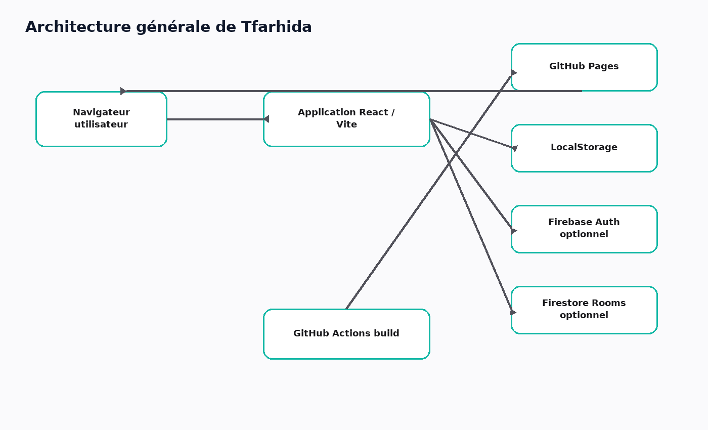{ width=85% }

## 4.2 Architecture local-first

Le mode local constitue le noyau du produit. Les joueurs, la langue, les preferences, les scores et l'historique sont geres dans le navigateur via un store global Zustand et un service de persistance `storageService`.

Cette architecture offre plusieurs avantages :

- absence de dependance reseau pour l'usage principal ;
- rapidite de lancement ;
- simplicite de demonstration ;
- robustesse pedagogique pour un PFE deploye publiquement.

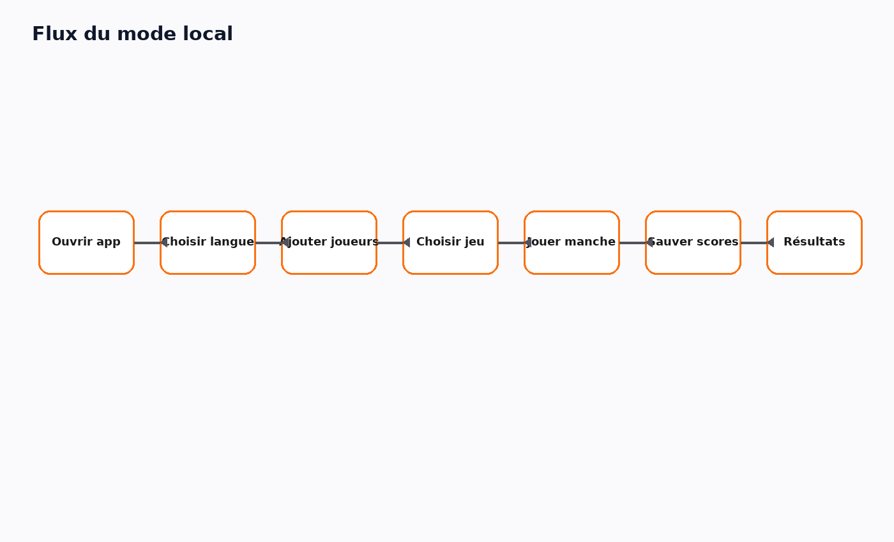{ width=85% }

## 4.3 Architecture GitHub Pages + Firebase

Le mode online a ete concu en tenant compte d'une contrainte forte : GitHub Pages ne fournit pas de backend applicatif. La couche temps reel s'appuie donc sur Firebase Auth et Firestore, services externes geres par le navigateur.

Le frontend React/Vite reste l'unique application deployee. Lorsqu'un utilisateur accede a une fonctionnalite online, le client initialise Firebase, authentifie l'utilisateur de facon anonyme, puis synchronise les documents Firestore necessaires.

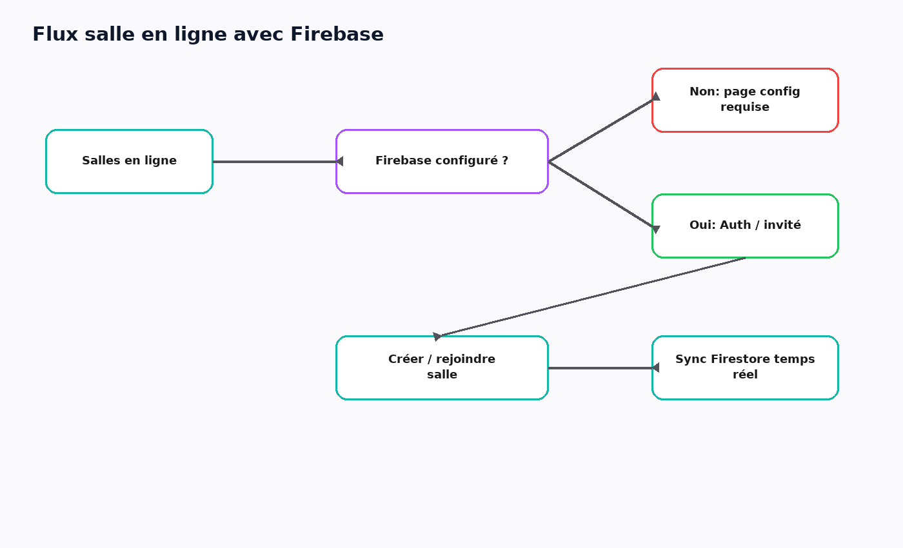{ width=85% }

## 4.4 Cas d'utilisation et interactions

Les usages principaux du systeme couvrent a la fois l'experience locale et le vertical slice realtime.

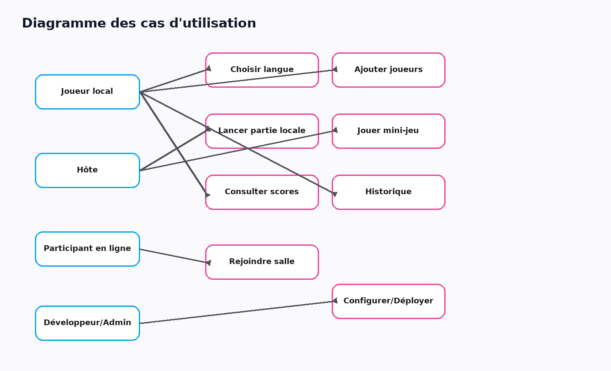{ width=82% }

## 4.5 Architecture frontend React/Vite/TypeScript

Le frontend est organise autour de plusieurs couches coherentes :

- **presentation** : composants UI, layout, ecrans et cartes de jeux ;
- **etat global** : store Zustand pour la langue, les joueurs, l'historique et l'etat de session ;
- **contenu** : donnees de jeux structurees en objets localises ;
- **services** : persistance locale, configuration Firebase, authentification et gestion des salles ;
- **routage** : `HashRouter` et routes par ecran.

| Dossier / module | Role |
|---|---|
| `src/App.tsx` | orchestration globale des pages et de la navigation |
| `src/app/store.ts` | etat global du produit |
| `src/services/storageService.ts` | persistance locale |
| `src/services/firebase*.ts` | configuration et acces Firebase |
| `src/services/authService.ts` | authentification anonyme |
| `src/services/roomService.ts` | logique online, listeners et votes |
| `src/data/games/` | contenu multilingue des jeux |
| `src/features/online/` | routes et interfaces du mode online |

: Tableau 4.1 — Principaux modules de l'architecture frontend.

## 4.6 Decision de routage : HashRouter

Le choix de `HashRouter` est directement lie au mode de diffusion. Sur GitHub Pages, une URL de type `/room/ABC123` poserait un probleme de rafraichissement si elle dependait du serveur. Avec `HashRouter`, les routes sont interpretees apres le caractere `#`, ce qui garantit la stabilite des liens `/#/online` et `/#/room/CODE` dans un contexte statique.

Ce choix est donc architectural avant d'etre technique. Il garantit la compatibilite entre experience utilisateur et contraintes d'hebergement.

## 4.7 Gestion d'etat et persistence locale

Le store Zustand centralise les donnees de session locale : langue, joueurs, historique, scores et dernier jeu actif. Le service `storageService` persiste ces informations dans `localStorage` avec le prefixe `tfarhida.v1.*`.

| Entite locale | Champs principaux | Role |
|---|---|---|
| `Player` | `id`, `name`, `avatar`, `color`, `score`, `isBot` | joueur local |
| `SessionResult` | `id`, `gameId`, `date`, `scores`, `winner` | historique de session |
| `Language` | `tn`, `fr`, `en` | langue active |
| `Settings.*` | cles de preferences | configuration locale |

: Tableau 4.2 — Modele de donnees local.

## 4.8 Internationalisation et support RTL

L'internationalisation est structuree autour de trois codes de langue :

- `tn` pour la derja tunisienne ;
- `fr` pour le francais ;
- `en` pour l'anglais.

Les contenus de jeux et les libelles UI sont stockes dans des objets localises. Le layout principal determine dynamiquement la direction d'affichage. Lorsque `tn` est actif, l'interface adopte un rendu compatible RTL ; `fr` et `en` restent en LTR.

Ce choix depasse la simple traduction. Il vise a rendre l'experience credible pour un usage reel dans des groupes qui alternent entre plusieurs langues.

## 4.9 Modele de domaine

Le domaine de Tfarhida s'organise autour de joueurs, de jeux, de manches, de sessions et de salles online. Cette separation clarifie la responsabilite de chaque entite et facilite l'extension progressive du produit.

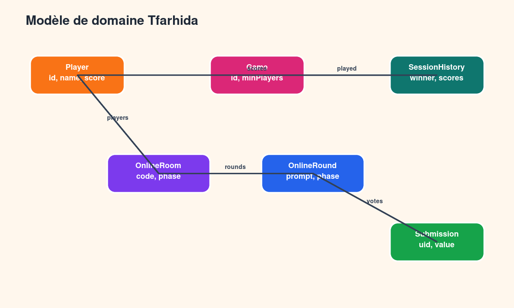{ width=82% }

## 4.10 Modele Firestore

Le mode online n'utilise pas un unique document monolithique. Il repose sur une structure en collections et sous-collections afin de limiter les conflits et de permettre des ecoutes ciblees.

| Collection / document | Role |
|---|---|
| `rooms/{code}` | metadonnees de salle, phase, scores, hote, jeu courant |
| `rooms/{code}/players/{uid}` | profil du joueur, presence, score, role hote/non hote |
| `rooms/{code}/rounds/{roundId}` | manche active, prompt, progression |
| `rooms/{code}/rounds/{roundId}/submissions/{uid}` | vote d'un joueur pour une manche donnee |
| `rooms/{code}/private/{uid}` | extension prevue pour etats caches futurs |
| `rooms/{code}/events/{eventId}` | evenements ou journaux d'action si necessaire |

: Tableau 4.3 — Structure des collections Firestore.

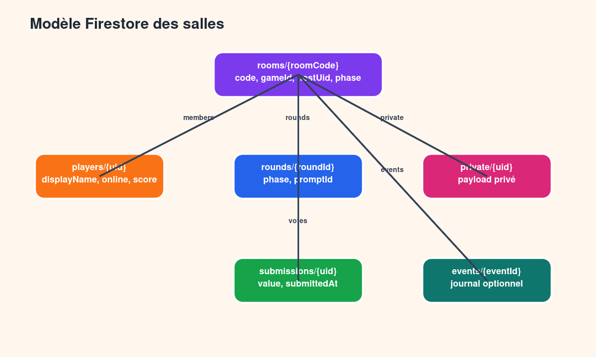{ width=82% }

## 4.11 Cycle de vie d'une salle online

Le cycle de vie online suit une sequence claire :

1. un hote cree une salle ;
2. Firebase Auth produit ou reutilise une session anonyme ;
3. Firestore cree le document de salle et le document joueur de l'hote ;
4. un invite rejoint via un code ou un lien ;
5. l'hote demarre la partie si le minimum de joueurs est atteint ;
6. une manche de **Tu preferes ?** est creee ;
7. chaque joueur soumet un vote unique ;
8. l'hote revele les resultats, met a jour les scores puis lance une manche suivante ou termine la salle.

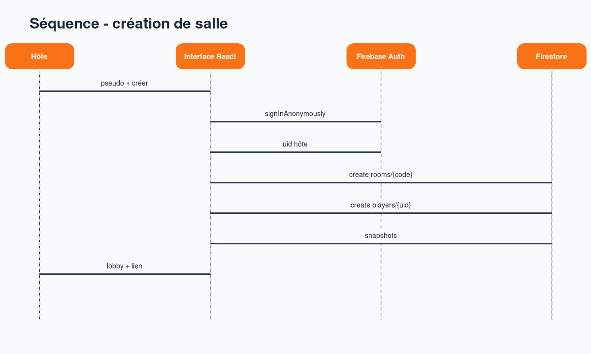{ width=85% }

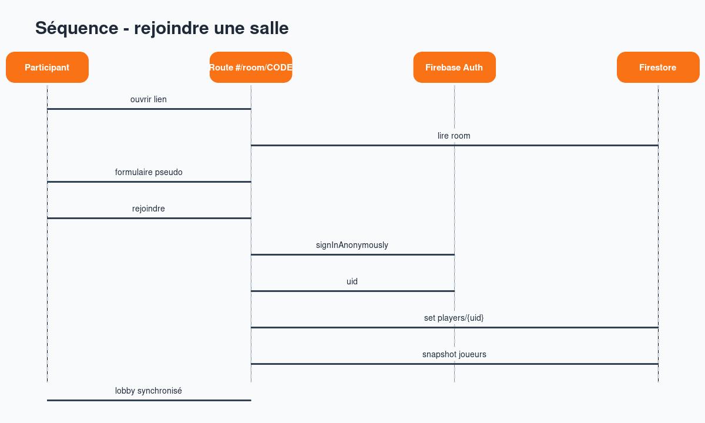{ width=85% }

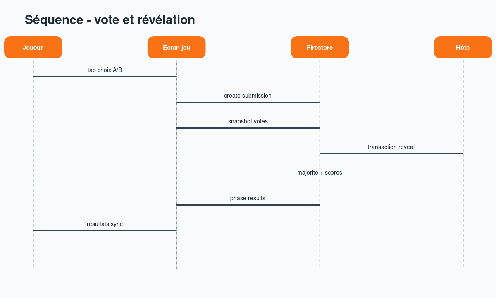{ width=85% }

## 4.12 Modele de securite

La securite du MVP online est fondee sur quatre principes :

- l'utilisateur doit etre authentifie ;
- les actions structurantes de salle reviennent a l'hote ;
- les joueurs ne modifient librement que leurs champs de presence et de profil ;
- un vote est cree une seule fois et n'est pas modifiable ensuite.

| Mecanisme | Principe |
|---|---|
| Firebase Auth anonyme | identifiant `uid` minimal sans friction utilisateur |
| Lecture salle | accessible a un utilisateur authentifie pour joindre la salle |
| Actions hote | demarrage, revelation, manche suivante, fin de partie |
| Auto-mise a jour joueur | limitee aux champs `displayName`, `avatar`, `color`, `online`, `lastSeenAt` |
| Vote | ecriture create-only dans `submissions/{uid}` |

: Tableau 4.4 — Regles de securite du mode online.

Ces regles sont pertinentes pour un MVP et ont ete deployees avec succes sur le projet Firebase `tfarhida-d1f5c`.

## 4.13 Limites de securite assumees

Tfarhida reste une application frontend. Meme avec Firebase Auth et Firestore Rules, elle ne doit pas etre presentee comme une plateforme anti-triche de niveau production. La logique metier sensible reste largement visible cote client. Les jeux a information cachee, comme **Qui est l'imposteur ?**, necessiteraient a terme un durcissement via Cloud Functions ou une logique serveur supplementaire.

## 4.14 Pipeline de deploiement

Le deploiement suit une chaine simple : push sur `main`, execution de GitHub Actions, build Vite, publication de `dist`, puis acces public via GitHub Pages. Les variables Firebase `VITE_FIREBASE_*` sont injectees au moment du build pour la version hebergee, sans exposer de secret prive.

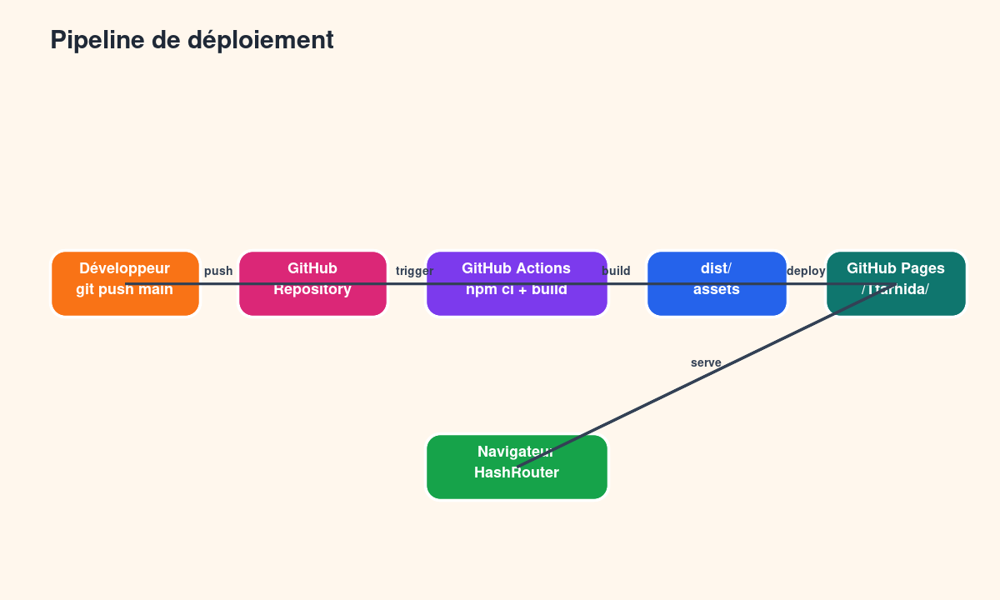{ width=84% }

\newpage

# Chapitre 5 — Realisation technique

## 5.1 Environnement de developpement

Le projet a ete developpe avec les technologies suivantes :

- React 18 pour l'interface ;
- Vite pour le bundling et le serveur de developpement ;
- TypeScript pour la robustesse typage ;
- Tailwind CSS pour la composition visuelle ;
- Zustand pour l'etat global ;
- React Router pour la navigation ;
- Firebase Web SDK pour l'authentification et Firestore.

Ces outils ont ete retenus pour leur compatibilite avec une application frontend statique et leur capacite a soutenir un MVP evolutif.

## 5.2 Structure du projet

```text
src/
  app/
  components/
  data/games/
  features/online/
  i18n/
  services/
  types/
docs/
  report/
  assets/report/
public/assets/
```

| Element | Role |
|---|---|
| `app/` | store et etat applicatif |
| `components/` | composants d'interface et layout |
| `data/games/` | contenu des mini-jeux |
| `features/online/` | interfaces et logique de presentation online |
| `services/` | persistance locale, Firebase, auth et salles |
| `docs/` | documentation technique et rapport |

: Tableau 5.1 — Structure du projet.

## 5.3 Mise en place de l'interface et du routage

La premiere etape de realisation a consiste a etablir une base stable avec `HashRouter`, un layout principal, une home page identifiable, une navigation simple et un systeme de langues visible dans l'en-tete. L'objectif etait de garantir tres tot la compatibilite GitHub Pages et une experience unifiee sur desktop et mobile.

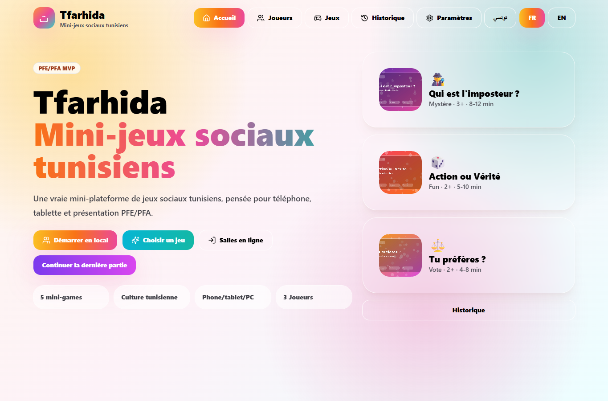{ width=78% }

## 5.4 Gestion des joueurs locaux

Le mode local repose sur une logique simple et concrete : l'utilisateur peut ajouter, modifier ou supprimer des joueurs, definir leur nom, leurs couleurs et leurs avatars, puis conserver ces donnees sur l'appareil.

Cette etape a ete essentielle, car elle conditionne toute la fluidite du mode local. Une attention particuliere a egalement ete apportee au cas des bots de demonstration, qui ne doivent jamais etre presentes comme de vrais joueurs automatiques.

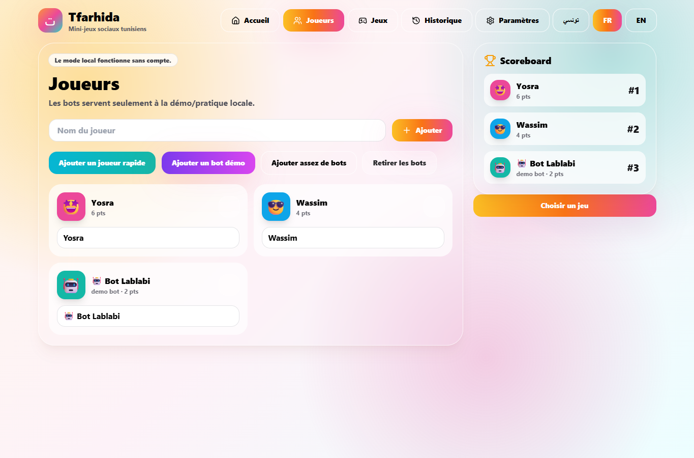{ width=78% }

## 5.5 Bibliotheque des mini-jeux

Le projet regroupe cinq mini-jeux dans une bibliotheque visuelle unique. Cette organisation permet de passer facilement d'une mecanique a une autre au cours d'une meme session et renforce la valeur du produit par rapport a une simple application mono-jeu.

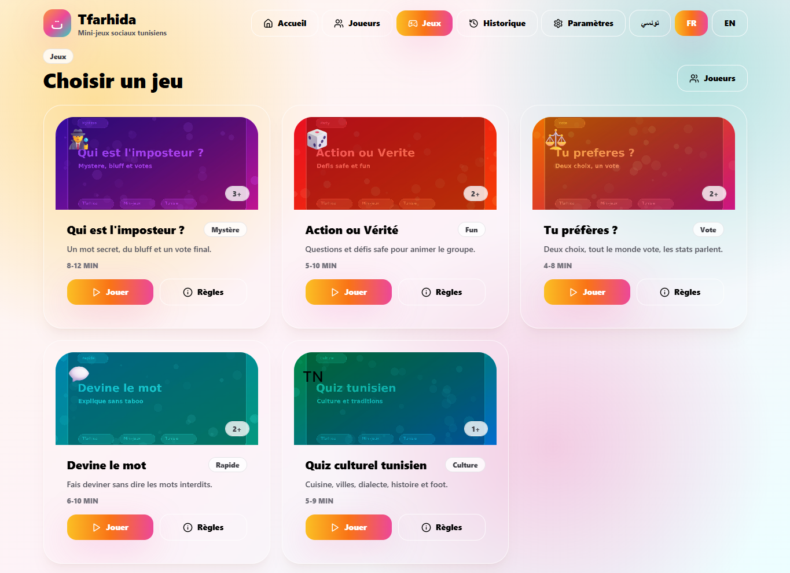{ width=82% }

## 5.6 Implementation des cinq mini-jeux du MVP

### 5.6.1 Tu preferes ?

Ce jeu propose deux choix et calcule le camp majoritaire. Il existe en mode local et sert egalement de base au vertical slice online.

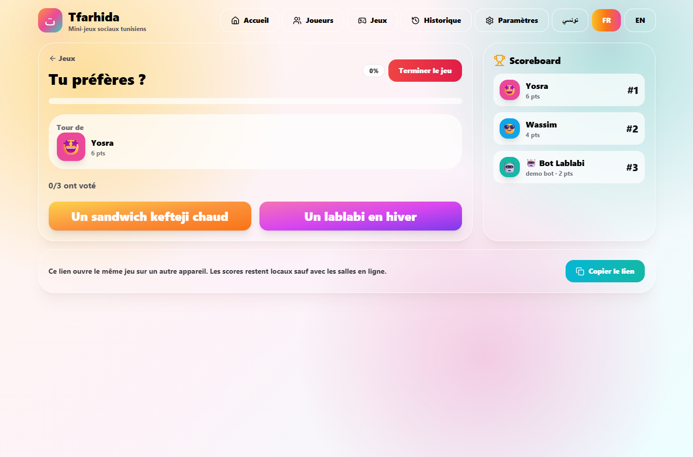{ width=75% }

### 5.6.2 Action ou Verite

Le jeu alterne questions et defis, avec une gestion de prompts adaptee a une ambiance de groupe et respectueuse du cadre academique et social du projet.

### 5.6.3 Devine le mot

Ce mini-jeu combine mot a faire deviner, termes interdits et dynamique rapide. Il renforce la variete du catalogue local.

### 5.6.4 Qui est l'imposteur ?

Le jeu gere une revelation privee et une phase de vote, mais reste local dans ce MVP. Cette limitation est assumee afin de ne pas promettre une protection online d'etat cache qui ne serait pas encore suffisamment durcie.

### 5.6.5 Quiz culturel tunisien

Le quiz valorise des references de culture generale tunisienne. Il participe directement a l'identite du projet et au positionnement non generique de Tfarhida.

## 5.7 Scores et historique

Le systeme de score et d'historique repose sur le store global et `storageService`. Lorsqu'une session produit un resultat significatif, celui-ci est enregistre localement et reaffiche dans l'historique. Ce comportement permet a l'application de conserver la memoire des soirees sans exiger de compte.

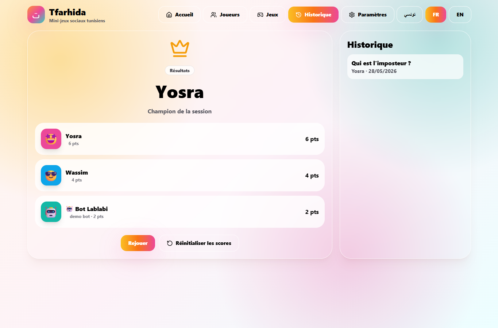{ width=78% }

## 5.8 Changement de langue et gestion RTL

L'implementation des langues a necessite une structuration precoce des textes UI et des contenus de jeux. La derja tunisienne est geree avec un rendu compatible RTL au niveau du layout principal. Cette prise en charge influence la hierarchie visuelle, l'alignement et la lecture des cartes.

## 5.9 Interface de configuration manquante pour Firebase

Une etape importante de la realisation a ete la suppression de tout faux comportement online. Lorsque Firebase n'est pas configure, l'application doit l'indiquer clairement et continuer a valoriser le mode local.

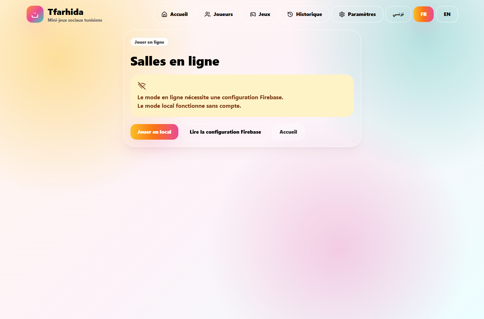{ width=76% }

## 5.10 Configuration Firebase et services associes

Le mode online s'appuie sur les modules suivants :

- `firebaseConfig.ts` pour la detection des variables Vite ;
- `firebase.ts` pour l'initialisation conditionnelle du SDK ;
- `authService.ts` pour l'authentification anonyme ;
- `roomService.ts` pour la creation, la jointure, les listeners, les manches et les votes.

Le projet Firebase associe au MVP porte l'identifiant `tfarhida-d1f5c`.

## 5.11 Authentification anonyme et creation de salle

L'authentification anonyme permet de reduire la friction d'entree tout en donnant un `uid` exploitable par les regles Firestore. Lorsqu'un hote cree une salle, l'application :

1. etablit ou reutilise une session anonyme ;
2. genere un code de salle ;
3. cree `rooms/{code}` ;
4. cree `players/{uid}` pour l'hote ;
5. redirige vers `/#/room/CODE`.

## 5.12 Jointure et synchronisation du lobby

La jointure de salle a fait l'objet d'une attention particuliere lors de la validation runtime. L'application a ete ajustee pour garantir une transition fiable de l'ecran de jointure vers le lobby et pour eviter des lectures Firestore prematurees qui pouvaient provoquer une erreur de permissions avant l'inscription du joueur dans la salle.

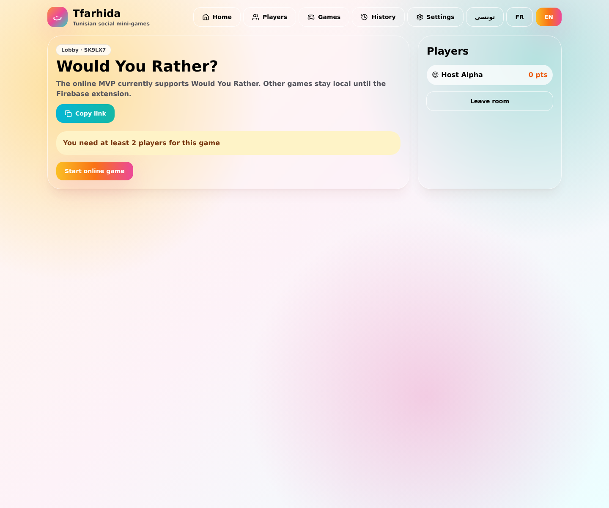{ width=80% }

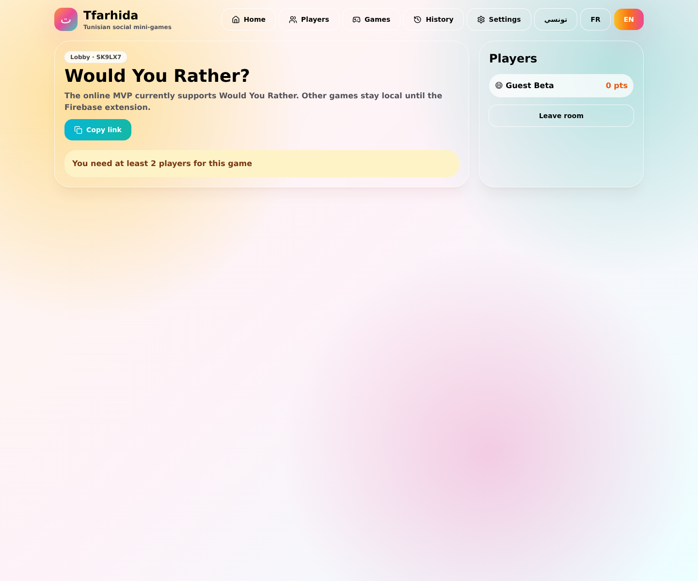{ width=80% }

## 5.13 Gameplay online de Tu preferes ?

Le gameplay online valide dans ce memoire concerne **Tu preferes ?**. L'hote demarre la partie, une manche est creee, chaque joueur vote, puis la majorite est calculee pour alimenter les scores.

Le code utilise un modele de vote create-only afin d'eviter l'ecrasement des choix deja soumis. Une fois les votes completes, l'hote peut reveler les resultats, lancer une nouvelle manche ou terminer la session.

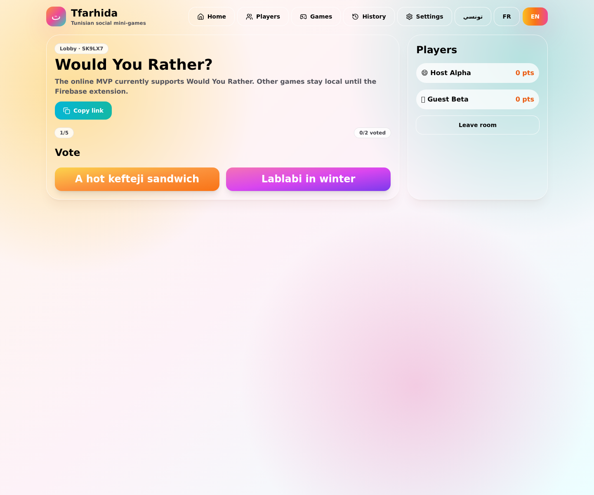{ width=78% }

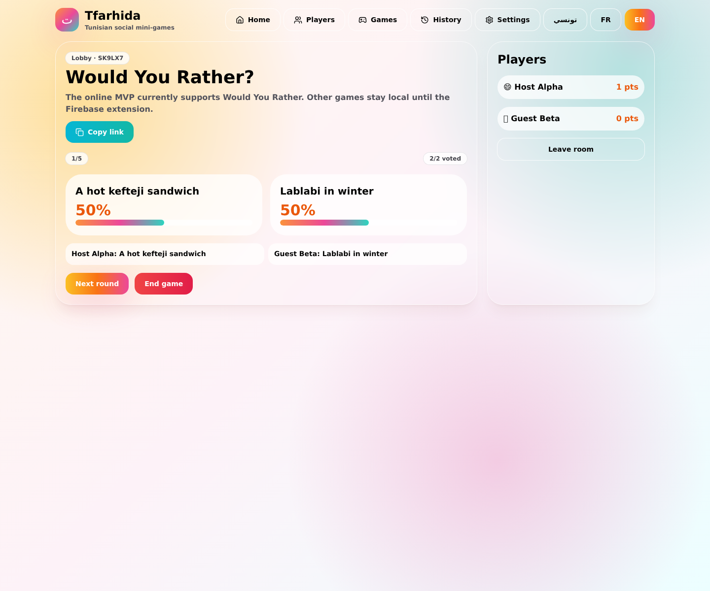{ width=74% }

## 5.14 Regles Firestore

Le fichier `firestore.rules` a ete durci pour traduire les hypotheses de securite du MVP :

- creation de salle reservee a un utilisateur authentifie ;
- lecture de salle conditionnee a l'authentification ;
- controle de salle reserve a l'hote ;
- auto-mise a jour joueur limitee aux champs de presence et de profil ;
- creation de vote reservee au joueur correspondant ;
- absence de mise a jour d'un vote apres creation.

Ces regles ont ete deployees avec succes sur le projet Firebase reel.

## 5.15 Deploiement GitHub Pages

Le deploiement est automatise par GitHub Actions. Le workflow reconstruit `dist`, injecte les variables publiques `VITE_FIREBASE_*`, puis publie les assets sur GitHub Pages. Vite est configure avec `base: "/Tfarhida/"`, ce qui rend l'URL publique compatible avec le depot cible.

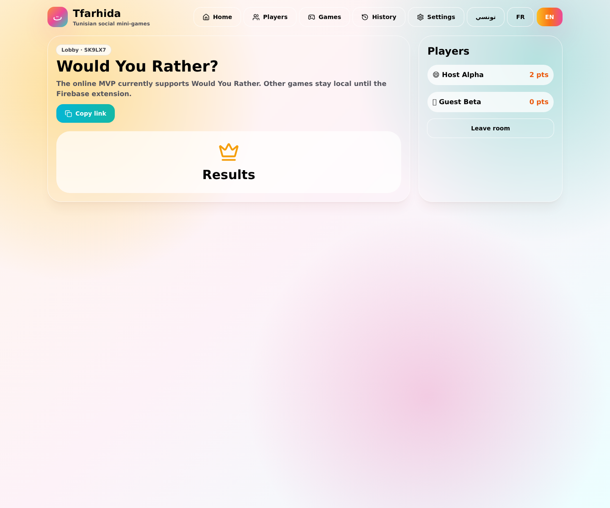{ width=78% }

\newpage

# Chapitre 6 — Tests et validation

## 6.1 Strategie de validation

La validation de Tfarhida repose sur trois niveaux complementaires :

- validation statique et qualite de code ;
- validation fonctionnelle locale et online ;
- validation de deploiement.

L'objectif n'est pas de revendiquer une exhaustivite industrielle, mais de prouver que le MVP presente dans ce memoire est reellement executable, verifiable et honnetement delimite.

## 6.2 Validation technique

| Verification | Resultat attendu | Statut |
|---|---|---|
| `npm run typecheck` | aucune erreur TypeScript | Valide |
| `npm run lint` | aucune erreur ESLint | Valide |
| `npm run build` | build de production genere | Valide |
| `grep -R "/src/main.tsx" dist/index.html` | aucune reference brute a la source | Valide |
| Separation des bundles | chunk online distinct du bundle principal | Valide |

: Tableau 6.1 — Validation technique du projet.

## 6.3 Validation Firebase et regles Firestore

Le projet Firebase utilise pour le MVP est `tfarhida-d1f5c`. Les regles Firestore ont ete corrigees, compilees et deployees avec succes. Cette etape est importante, car elle confirme que la politique d'acces du mode online n'est pas theorique mais bien appliquee sur un projet reel.

## 6.4 Test runtime local a deux navigateurs

Un test runtime reel a ete execute localement avec deux sessions navigateur distinctes via Playwright. Ce test a valide :

- creation d'une salle par l'hote ;
- jointure par code depuis une seconde session ;
- synchronisation du lobby ;
- blocage du demarrage tant que le nombre minimal de joueurs n'est pas atteint ;
- vote croise sur **Tu preferes ?** ;
- prevention du double vote ;
- revelation synchronisee des resultats ;
- mise a jour des scores ;
- manche suivante ;
- fin de partie ;
- sortie de salle.

| Etape verifiee | Resultat observe |
|---|---|
| Creation de salle | Reussie |
| Jointure par code | Reussie |
| Lobby hote / invite | Synchronise |
| Rafraichissement invite | Correct |
| Vote unique par joueur | Respecte |
| Resultats et scores | Synchronises |
| Manche suivante | Fonctionnelle |
| Fin de partie | Fonctionnelle |
| Quitter la salle | Fonctionnel |

: Tableau 6.2 — Validation runtime du mode online.

{ width=76% }

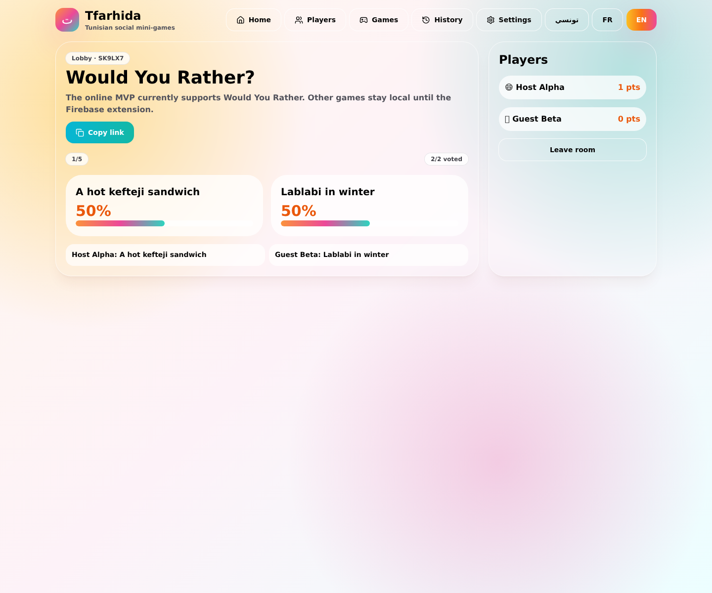{ width=76% }

## 6.5 Validation du deploiement public

La version publique `https://jodouma.github.io/Tfarhida/` a repondu avec un statut HTTP `200`, ce qui confirme la disponibilite du frontend publie. Le workflow GitHub Actions est deja configure pour utiliser les variables `VITE_FIREBASE_*` du depot lors du build heberge.

## 6.6 Limites de validation a expliciter

La validation doit rester honnete sur un point important : l'activation effective du Firebase online cote GitHub Pages depend encore de la presence des variables `VITE_FIREBASE_*` dans les **Repository Variables** de GitHub Actions. Le mode local, lui, reste deployable et jouable independamment.

De plus, seul **Tu preferes ?** est valide en temps reel dans cette version. Les autres jeux demeurent locaux et doivent etre presentes comme tels dans toute demonstration ou soutenance.

\newpage

# Chapitre 7 — Deploiement

## 7.1 Hebergement sur GitHub Pages

Le projet est deploye sur GitHub Pages, ce qui impose un frontend statique et favorise une diffusion simple depuis le depot GitHub. Cette solution est particulierement adaptee a un MVP academique, car elle evite la mise en place d'une infrastructure serveur privee.

## 7.2 Configuration Vite et HashRouter

Le deploiement repose sur deux choix techniques complementaires :

- `base: "/Tfarhida/"` pour que les assets soient servis sous le bon sous-chemin ;
- `HashRouter` pour garantir des routes stables lors des rafraichissements.

Sans cette combinaison, l'application risquerait de charger des chemins invalides ou de produire des erreurs 404 en navigation directe.

## 7.3 Workflow GitHub Actions

Le workflow `.github/workflows/deploy.yml` suit les etapes suivantes :

1. recuperation du code depuis `main` ;
2. installation des dependances ;
3. build Vite avec injection des variables `VITE_FIREBASE_*` ;
4. publication du dossier `dist` sur GitHub Pages.

Les valeurs injectees sont des parametres publics de configuration frontend. La securite effective reste fondee sur Firebase Auth et Firestore Rules.

## 7.4 Projet Firebase et configuration associee

Le projet Firebase utilise pour le MVP est :

- **Project ID :** `tfarhida-d1f5c`
- **Web App :** `Tfarhida Web`

Le mode online exige :

- Firebase Auth avec **Anonymous Authentication** activee ;
- Firestore Database ;
- regles `firestore.rules` deployees ;
- domaines autorises : `jodouma.github.io`, `localhost`, `127.0.0.1`.

## 7.5 Checklist de deploiement

| Verification | Etat attendu |
|---|---|
| Build Vite | Reussi |
| Publication GitHub Pages | Reussie |
| Base `/Tfarhida/` | Correcte |
| HashRouter | Actif |
| Variables `VITE_FIREBASE_*` | Configurees dans GitHub Actions |
| Projet Firebase `tfarhida-d1f5c` | Disponible |
| Firestore Rules | Deployees |
| Anonymous Auth | Activee |
| Domaines autorises | Configures |

: Tableau 7.1 — Checklist de deploiement.

## 7.6 Limites operationnelles du MVP

Le mode online heberge depend de la coherence entre le build GitHub Pages et la configuration Firebase du projet reel. Il n'existe pas de backend prive intermediaire pour recuperer ou proteger des etats caches complexes. Cette limite est acceptable pour un MVP academique, mais elle doit etre explicitement assume en soutenance.

\newpage

# Conclusion generale

Le projet Tfarhida a permis de concevoir et de realiser une application web originale de mini-jeux sociaux tunisiens, multilingue, responsive et deployable sur GitHub Pages. Le resultat obtenu repond aux objectifs majeurs definis au debut du travail : proposer un mode local immediate, un catalogue de cinq jeux, une identite culturelle differenciante, un support `tn/fr/en`, ainsi qu'une premiere extension realtime fonctionnelle et validee pour **Tu preferes ?**.

Sur le plan technique, le projet montre qu'il est possible de construire un MVP serieux sans backend prive, a condition d'adopter une architecture locale robuste, une integration prudente de Firebase et une documentation honnete des limites. Sur le plan pedagogique, il a permis de mobiliser des competences en UX, frontend engineering, persistence locale, securite Firestore, deploiement continu et validation.

Les difficultes principales ont porte sur la contrainte d'hebergement statique, la gestion honnete du mode online et les limites de securite inherentes a une application frontend. Ces difficultes ont conduit a des choix maitrises : un mode local prioritaire, une authentification anonyme, des regles Firestore strictes pour le vertical slice valide, et une presentation claire des fonctions encore locales.

Les perspectives d'evolution sont nombreuses :

- extension du mode online aux autres jeux ;
- durcissement du modele de donnees privees pour les jeux a role cache ;
- usage de Cloud Functions pour les actions sensibles ;
- ajout d'un tableau de bord d'administration de contenus ;
- enrichissement du catalogue de questions, defis et quiz ;
- emballage mobile via un wrapper type Capacitor ;
- automatisation plus large des tests ;
- amelioration de l'accessibilite et instrumentation analytique.

Ainsi, Tfarhida constitue une base credible, jouable et evolutive, qui remplit sa mission de MVP academique tout en ouvrant des perspectives concretes de prolongement.

\newpage

# Bibliographie / Webographie

1. React Documentation. [https://react.dev/](https://react.dev/)
2. Vite Guide. [https://vite.dev/guide/](https://vite.dev/guide/)
3. TypeScript Documentation. [https://www.typescriptlang.org/docs/](https://www.typescriptlang.org/docs/)
4. Tailwind CSS Documentation. [https://tailwindcss.com/docs/installation](https://tailwindcss.com/docs/installation)
5. Firebase Documentation. [https://firebase.google.com/docs](https://firebase.google.com/docs)
6. Firestore Security Rules Documentation. [https://firebase.google.com/docs/firestore/security/get-started](https://firebase.google.com/docs/firestore/security/get-started)
7. GitHub Pages Documentation. [https://docs.github.com/pages](https://docs.github.com/pages)
8. GitHub Actions Documentation. [https://docs.github.com/actions](https://docs.github.com/actions)

\newpage

# Annexes

## Annexe A — Configuration Firebase locale

Le fichier `.env.local` local, non committe, doit contenir :

```env
VITE_FIREBASE_API_KEY=
VITE_FIREBASE_AUTH_DOMAIN=
VITE_FIREBASE_PROJECT_ID=
VITE_FIREBASE_STORAGE_BUCKET=
VITE_FIREBASE_MESSAGING_SENDER_ID=
VITE_FIREBASE_APP_ID=
```

Le projet cible est `tfarhida-d1f5c` et l'application Web associee est `Tfarhida Web`.

## Annexe B — Variables GitHub Actions du build public

| Variable | Usage |
|---|---|
| `VITE_FIREBASE_API_KEY` | configuration publique Firebase |
| `VITE_FIREBASE_AUTH_DOMAIN` | domaine Auth |
| `VITE_FIREBASE_PROJECT_ID` | identifiant du projet |
| `VITE_FIREBASE_STORAGE_BUCKET` | bucket de stockage |
| `VITE_FIREBASE_MESSAGING_SENDER_ID` | sender ID |
| `VITE_FIREBASE_APP_ID` | identifiant de l'application Web |

: Tableau A.1 — Variables GitHub Actions pour le build public.

## Annexe C — Resume des regles Firestore

- creation de salle reservee a un utilisateur authentifie ;
- lecture de salle autorisee a un utilisateur authentifie ;
- actions critiques reservees a l'hote ;
- lecture des joueurs reservee aux membres ou a l'hote ;
- auto-mise a jour des joueurs limitee aux champs de presence et de profil ;
- votes non modifiables apres creation.

## Annexe D — Checklist de validation

```text
npm run typecheck
npm run lint
npm run build
grep -R "/src/main.tsx" dist/index.html
verification du statut HTTP 200 de l'URL publique
test runtime local a deux sessions navigateur
```

## Annexe E — Inventaire des routes

| Route | Role |
|---|---|
| `/#/` | accueil |
| `/#/players` | gestion des joueurs |
| `/#/games` | bibliotheque des jeux |
| `/#/play/:id` | partie locale |
| `/#/results` | historique et resultats |
| `/#/settings` | parametres |
| `/#/about` | presentation du projet |
| `/#/online` | entree du mode online |
| `/#/room/:code` | lobby et partie online |

## Annexe F — Inventaire des diagrammes

| Fichier | Usage |
|---|---|
| `01-architecture-generale.png` | architecture globale |
| `02-flow-mode-local.png` | flux du mode local |
| `03-flow-salle-en-ligne-firebase.png` | flux online |
| `04-cas-utilisation.png` | cas d'utilisation |
| `05-modele-domaine.png` | modele de domaine |
| `06-sequence-creation-salle.png` | sequence creation |
| `07-sequence-rejoindre-salle.png` | sequence jointure |
| `08-sequence-vote-revelation.png` | sequence vote/revelation |
| `09-modele-firestore.png` | modele Firestore |
| `10-pipeline-deploiement.png` | pipeline de deploiement |

## Annexe G — Inventaire des captures d'ecran

| Fichier | Usage |
|---|---|
| `01-home-page.png` | accueil |
| `02-player-setup.png` | joueurs locaux |
| `03-game-library.png` | catalogue |
| `04-would-you-rather.png` | gameplay local |
| `10-results-history.png` | historique |
| `12-online-firebase-fallback.png` | fallback configuration |
| `online-lobby-host.png` | lobby cote hote |
| `online-lobby-guest.png` | lobby cote invite |
| `online-vote-host.png` | vote online |
| `online-results-host.png` | resultats cote hote |
| `online-results-guest.png` | resultats cote invite |
| `online-ended-host.png` | fin de partie cote hote |

## Annexe H — Commandes utiles

```bash
npm run dev
npm run typecheck
npm run lint
npm run build
npx firebase-tools deploy --only firestore:rules --project tfarhida-d1f5c
git push origin main
```
