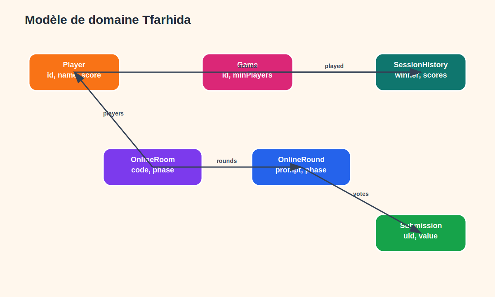
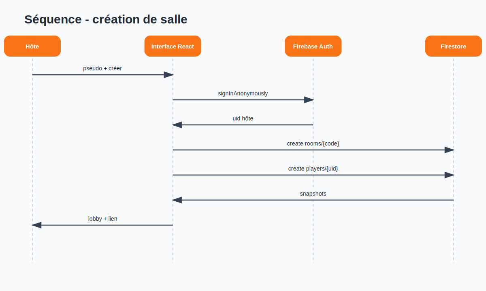
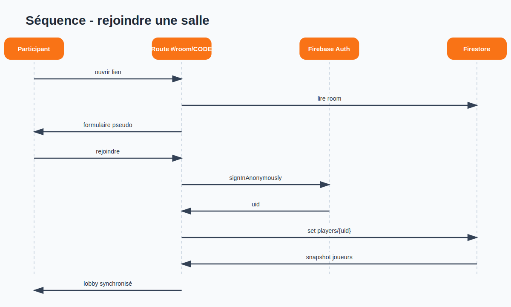
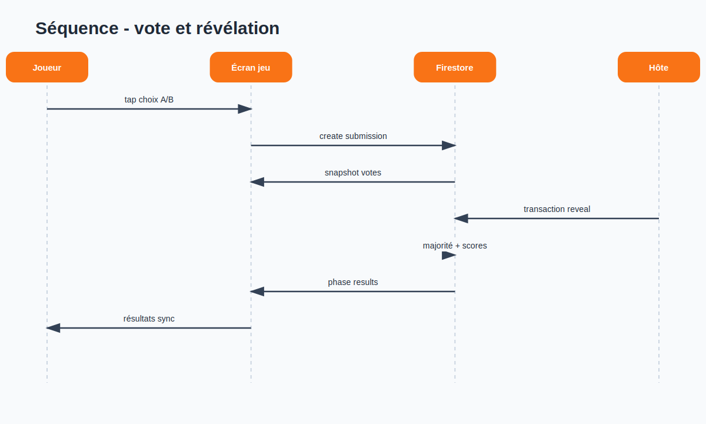
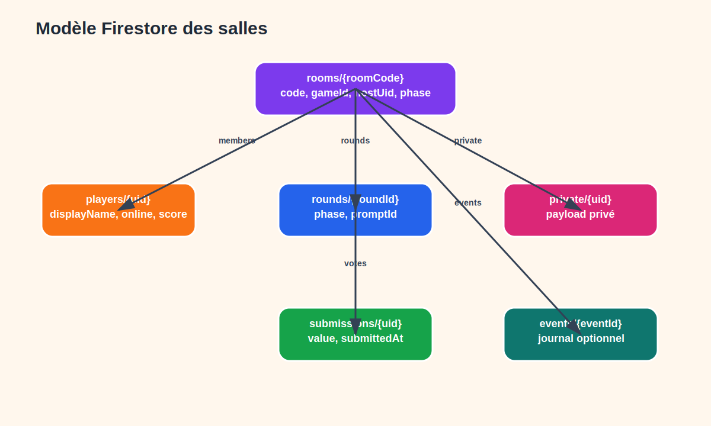
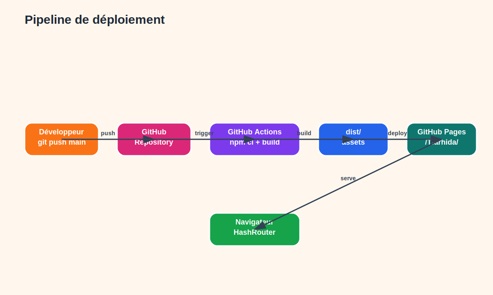

# Rapport PFE — Tfarhida

## Page de garde

**Titre :** Tfarhida — Application web de mini-jeux sociaux tunisiens  
**Type :** Rapport de Projet de Fin d’Études — Bachelor / Licence  
**Institution :** Leaders University — Nabeul  
**Réalisé par :** Yosra El Hadj Brayek, Wassim Chommakh  
**Encadrante pédagogique :** Madame Imen Herzi  
**Année universitaire :** 2025–2026  

> Source de travail v2. Ce fichier constitue la base académique à relire et enrichir avant export DOCX/PDF.

## Remerciements

Nous remercions Madame Imen Herzi pour son encadrement, ses orientations et ses retours tout au long de la réalisation de ce projet. Nous remercions également l’équipe pédagogique de Leaders University — Nabeul pour l’accompagnement académique, ainsi que nos familles et proches pour leur soutien.

## Résumé

Tfarhida est une application web statique de mini-jeux sociaux tunisiens. Elle répond au besoin d’une expérience de jeu collective, simple, multilingue et accessible sans installation lourde. Le projet repose sur un mode local pleinement fonctionnel basé sur `localStorage`, et sur un mode en ligne optionnel reposant sur Firebase Auth et Firestore lorsque la configuration est fournie. Le MVP comprend cinq mini-jeux en mode local et un premier jeu synchronisé en ligne, **Tu préfères ?**, avec lobby, lien de salle, votes et scores temps réel.

**Mots-clés :** React, Vite, Firebase, Firestore, GitHub Pages, mini-jeux sociaux, culture tunisienne, PFE.

## Abstract

Tfarhida is a static web application for Tunisian social mini-games. It provides a local-first, multilingual and responsive party-game experience. The project includes a fully functional local mode using `localStorage` and an optional online mode powered by Firebase Auth and Firestore when configured. The MVP provides five local mini-games and one synchronized online game, **Would You Rather**, with lobby, shareable room link, realtime voting and synchronized scores.

**Keywords:** React, Vite, Firebase, Firestore, GitHub Pages, social mini-games, Tunisian culture.

## Liste des figures prévues

| Réf. | Titre | Source |
|---|---|---|
| Figure 4.1 | Architecture générale | `docs/assets/report/diagrams/01-architecture-generale.*` |
| Figure 4.2 | Flux du mode local | `docs/assets/report/diagrams/02-flow-mode-local.*` |
| Figure 4.3 | Flux salle Firebase | `docs/assets/report/diagrams/03-flow-salle-en-ligne-firebase.*` |
| Figure 4.4 | Cas d’utilisation | `docs/assets/report/diagrams/04-cas-utilisation.*` |
| Figure 4.5 | Modèle de domaine | `docs/assets/report/diagrams/05-modele-domaine.svg` |
| Figure 4.6 | Séquence création salle | `docs/assets/report/diagrams/06-sequence-creation-salle.svg` |
| Figure 4.7 | Séquence rejoindre salle | `docs/assets/report/diagrams/07-sequence-rejoindre-salle.svg` |
| Figure 4.8 | Séquence vote/révélation | `docs/assets/report/diagrams/08-sequence-vote-revelation.svg` |
| Figure 4.9 | Modèle Firestore | `docs/assets/report/diagrams/09-modele-firestore.svg` |
| Figure 7.1 | Pipeline GitHub Pages | `docs/assets/report/diagrams/10-pipeline-deploiement.svg` |

> Note de préparation : les sources Mermaid `05` à `10` sont conservées. Mermaid CLI n’a pas terminé dans un délai raisonnable dans l’environnement courant ; des versions SVG vectorielles équivalentes ont donc été générées pour le rapport.

## Liste des tableaux prévus

| Réf. | Titre |
|---|---|
| Tableau 1 | Comparaison de solutions existantes |
| Tableau 2 | Acteurs du système |
| Tableau 3 | Besoins fonctionnels |
| Tableau 4 | Besoins non fonctionnels |
| Tableau 5 | Backlog MVP |
| Tableau 6 | Modèle de données local |
| Tableau 7 | Modèle Firestore |
| Tableau 8 | Technologies utilisées |
| Tableau 9 | Tests fonctionnels et techniques |
| Tableau 10 | Limites et perspectives |

## Liste des abréviations

| Abréviation | Signification |
|---|---|
| MVP | Minimum Viable Product |
| PFE | Projet de Fin d’Études |
| UI | User Interface |
| UX | User Experience |
| SDK | Software Development Kit |
| SPA | Single Page Application |
| RTL | Right To Left |
| CI/CD | Continuous Integration / Continuous Deployment |

# Introduction générale

Les applications de divertissement occupent une place importante dans les usages numériques actuels. Toutefois, une grande partie des jeux mobiles privilégie l’expérience individuelle ou des contenus internationaux génériques. Dans le contexte tunisien, les soirées familiales, les rencontres entre amis et les activités étudiantes reposent souvent sur des interactions spontanées, de l’humour local, des références culturelles et une alternance naturelle entre arabe tunisien, français et anglais.

Le projet Tfarhida part de ce constat. Il vise à proposer une application web de mini-jeux sociaux tunisiens, déployable facilement sur GitHub Pages et utilisable immédiatement en mode local. L’approche retenue est volontairement pragmatique : livrer un MVP stable, jouable, responsive et documenté, tout en préparant une évolution vers le multijoueur temps réel grâce à Firebase.

La problématique peut être formulée ainsi : **comment concevoir et réaliser une application de mini-jeux sociaux culturellement adaptée, jouable localement sans compte, compatible avec un hébergement statique, et extensible vers un mode en ligne sans simuler de faux multijoueur ?**

La démarche suivie s’organise en cinq étapes : analyse du cahier des charges, conception de l’architecture frontend et des données, réalisation du mode local, intégration progressive d’un mode Firebase réel, puis validation technique et fonctionnelle.

## Organisation du rapport

Le rapport est structuré selon une démarche académique progressive. Le premier chapitre présente le cadre général, les objectifs et les contraintes. Le deuxième chapitre étudie les solutions existantes et précise le positionnement de Tfarhida. Le troisième chapitre formalise les besoins fonctionnels et non fonctionnels. Le quatrième chapitre décrit la conception, notamment l’architecture frontend, la persistance locale et le modèle Firebase. Le cinquième chapitre détaille la réalisation technique étape par étape. Le sixième chapitre présente la stratégie de test et les validations effectuées. Le dernier chapitre explique le déploiement sur GitHub Pages et les conditions de configuration Firebase.

# Chapitre 1 — Cadre général du projet

## 1.1 Contexte académique

Ce projet s’inscrit dans le cadre d’un Projet de Fin d’Études Bachelor à Leaders University — Nabeul. Il constitue une réalisation logicielle complète, allant de l’idée initiale jusqu’au déploiement d’un MVP accessible publiquement.

## 1.2 Évolution de BitBox vers Tfarhida

Le cahier des charges initial portait le nom BitBox. L’idée de départ était une application de mini-jeux sociaux inspirés de la culture tunisienne. Durant la réalisation, l’identité a évolué vers Tfarhida afin de mieux traduire l’ambiance locale, festive et sociale du produit. Cette évolution ne modifie pas le besoin fonctionnel de base, mais améliore le positionnement culturel et la lisibilité du projet.

## 1.3 Objectifs

Les objectifs principaux sont :

- offrir un mode local jouable immédiatement ;
- gérer les joueurs, avatars, scores et résultats ;
- proposer cinq mini-jeux inspirés de situations sociales ;
- supporter trois langues : tunisien, français et anglais ;
- respecter la contrainte d’un hébergement statique GitHub Pages ;
- préparer un vrai mode en ligne basé sur Firebase, sans faux multijoueur.

## 1.3.1 Objectifs spécifiques

Les objectifs généraux sont déclinés en objectifs mesurables. L’application doit permettre de créer une liste de joueurs, de démarrer une partie locale sans connexion, de sélectionner un mini-jeu selon le nombre de joueurs, de suivre une progression de manche, d’afficher les scores et d’enregistrer un historique local. Elle doit aussi séparer clairement les liens locaux, qui ouvrent simplement le même jeu, des liens de salles en ligne, qui nécessitent Firebase pour synchroniser plusieurs appareils.

Sur le plan technique, le projet doit rester compatible avec un hébergement statique. Cette contrainte exclut un backend privé dans le MVP. La solution retenue consiste donc à utiliser le navigateur comme environnement d’exécution principal, `localStorage` pour la sauvegarde locale, et Firebase comme service externe optionnel pour l’authentification et la synchronisation.

## 1.4 Contraintes

| Contrainte | Impact sur la conception |
|---|---|
| GitHub Pages | Application frontend statique, pas de serveur privé. |
| Multilingue | Données et UI structurées en `tn`, `fr`, `en`. |
| Mode local obligatoire | Persistance dans `localStorage` et fonctionnement hors Firebase. |
| Online honnête | Firebase requis pour le temps réel ; fallback clair sinon. |
| Sécurité | Pas de secrets ni de mots de passe dans le dépôt ou `localStorage`. |

## 1.5 Périmètre MVP

Le périmètre du MVP est volontairement maîtrisé. Le mode local couvre les cinq jeux définis dans le cahier des charges : Tu préfères ?, Action ou Vérité, Devine le mot, Qui est l’imposteur et Quiz culturel tunisien. Le mode en ligne couvre un premier vertical slice complet : Tu préfères ? en temps réel avec salle, joueurs, votes, résultats et scores.

Ce choix permet de démontrer la faisabilité du multijoueur Firebase sans fragiliser l’ensemble de l’application. Les autres jeux restent local-only dans cette version et sont présentés comme perspectives d’évolution pour le mode online.

## 1.6 Méthodologie de réalisation

La réalisation a suivi une démarche incrémentale. Une première étape a consisté à stabiliser l’application statique, le routage GitHub Pages et les écrans locaux. Une deuxième étape a amélioré l’expérience utilisateur, les couleurs, la gestion des joueurs et les flows de jeux. Une troisième étape a intégré Firebase de manière prudente : aucun écran ne doit prétendre fonctionner en ligne si Firebase n’est pas configuré. Enfin, la documentation technique et le rapport ont été préparés à partir des fonctionnalités réellement implémentées.

# Chapitre 2 — Étude de l’existant

Les jeux sociaux numériques comme les quiz, jeux de vote, jeux d’ambiance ou jeux d’imposteur existent déjà sous plusieurs formes. Cependant, ces solutions sont souvent spécialisées dans un seul jeu, fortement dépendantes d’un backend propriétaire ou peu adaptées au contexte culturel tunisien. Les applications de quiz culturel existent également, mais elles privilégient souvent une interaction individuelle plutôt qu’un moment collectif.

| Solution observée | Points forts | Limites |
|---|---|---|
| Applications de quiz généralistes | Simples, rapides, nombreuses questions | Peu sociales, contenu culturel générique |
| Jeux d’ambiance mobiles | Interaction de groupe, règles connues | Souvent monolingues ou orientés marché international |
| Jeux d’imposteur en ligne | Suspense, multijoueur | Backend obligatoire, complexité d’accès |
| Cartes physiques | Faciles à comprendre | Pas de score automatisé, pas de multilingue dynamique |

Tfarhida se positionne comme une alternative locale-first : elle privilégie la facilité d’usage et la culture tunisienne, tout en gardant une architecture extensible vers Firebase.

## 2.1 Analyse comparative détaillée

L’étude de l’existant met en évidence trois familles de solutions. La première regroupe les jeux mobiles d’ambiance, qui proposent souvent une interface simple mais un contenu générique. La deuxième concerne les applications de quiz, riches en questions mais moins adaptées à une dynamique de groupe. La troisième regroupe les jeux multijoueurs en ligne, plus interactifs mais dépendants d’une infrastructure réseau et parfois difficiles à déployer dans un contexte académique.

| Critère | Jeux d’ambiance mobiles | Quiz culturels | Jeux multijoueurs online | Tfarhida |
|---|---|---|---|---|
| Mode local immédiat | Variable | Souvent oui | Rare | Oui |
| Ancrage tunisien | Faible | Variable | Faible | Fort |
| Multilingue tn/fr/en | Rare | Rare | Rare | Oui |
| Déploiement statique | Non applicable | Non applicable | Non | Oui |
| Scores et historique local | Variable | Oui | Oui | Oui |
| Online temps réel | Variable | Rare | Oui | Partiel via Firebase |

## 2.2 Synthèse de la problématique

La problématique ne se limite pas à créer quelques écrans de questions. Elle porte sur la combinaison de plusieurs exigences parfois contradictoires : simplicité d’usage, identité culturelle, responsive design, absence de backend privé, sauvegarde locale et préparation d’un vrai online. Le défi technique consiste donc à construire une architecture suffisamment simple pour être maintenable, mais assez structurée pour évoluer vers des salles Firebase.

# Chapitre 3 — Analyse et spécification des besoins

## 3.1 Acteurs

| Acteur | Description |
|---|---|
| Joueur local | Participe sur un appareil partagé. |
| Hôte local | Ajoute les joueurs, choisit le jeu et termine la session. |
| Participant en ligne | Rejoint une salle Firebase par lien ou code. |
| Hôte en ligne | Crée la salle, partage le lien et démarre la partie. |
| Développeur/Admin | Configure Firebase, maintient le code et déploie. |

## 3.2 Besoins fonctionnels

| Réf. | Besoin | Statut |
|---|---|---|
| BF1 | Ajouter/modifier/supprimer des joueurs locaux | Implémenté |
| BF2 | Ajouter des bots de démonstration explicites | Implémenté |
| BF3 | Choisir un mini-jeu depuis une bibliothèque | Implémenté |
| BF4 | Jouer cinq mini-jeux en local | Implémenté |
| BF5 | Gérer scores, résultats et historique | Implémenté |
| BF6 | Changer la langue `tn/fr/en` | Implémenté |
| BF7 | Créer une salle online Firebase | Implémenté si Firebase configuré |
| BF8 | Rejoindre une salle via `/#/room/CODE` | Implémenté si Firebase configuré |
| BF9 | Synchroniser votes et scores online | Implémenté pour Tu préfères ? |

## 3.3 Besoins non fonctionnels

| Réf. | Besoin | Réponse technique |
|---|---|---|
| BNF1 | Responsive | Tailwind CSS, layout mobile-first |
| BNF2 | Performance | Vite, app statique, build optimisé |
| BNF3 | Maintenabilité | TypeScript, services dédiés, données structurées |
| BNF4 | Sécurité | Firebase Auth, règles Firestore, pas de secrets |
| BNF5 | Déploiement simple | GitHub Actions + GitHub Pages |
| BNF6 | Honnêteté produit | Online désactivé si Firebase absent |

## 3.4 Règles métier

| Règle | Description |
|---|---|
| RM1 | Aucun joueur réel ne doit être créé automatiquement au premier lancement. |
| RM2 | Les bots sont autorisés seulement pour la démo locale et doivent être explicitement marqués. |
| RM3 | Chaque jeu vérifie son minimum de joueurs avant le lancement. |
| RM4 | Un résultat local est sauvegardé seulement si une partie a produit un score. |
| RM5 | Un lien local ne synchronise pas les scores entre appareils. |
| RM6 | Un lien de salle online est temps réel seulement lorsque Firebase est configuré. |
| RM7 | Le mode online ne doit pas afficher de faux login ni de fausse salle. |
| RM8 | Une submission online représente un seul vote par joueur et par manche. |

## 3.5 Cas d’utilisation principaux

Les cas d’utilisation couvrent deux contextes : le mode local sur un appareil partagé et le mode online Firebase.

| Cas d’utilisation | Acteur principal | Résultat attendu |
|---|---|---|
| Choisir la langue | Joueur local | Interface affichée en tn/fr/en |
| Ajouter des joueurs | Hôte local | Liste de joueurs sauvegardée localement |
| Lancer une partie locale | Hôte local | Jeu ouvert si minimum de joueurs atteint |
| Voter/répondre | Joueur | Score ou état de manche mis à jour |
| Consulter les résultats | Hôte local | Classement et historique visibles |
| Créer une salle | Hôte online | Room Firestore et lien partageable |
| Rejoindre une salle | Participant online | Joueur ajouté au lobby |
| Voter en ligne | Participant online | Vote stocké dans Firestore |

## 3.6 Contraintes de sécurité et confidentialité

Le projet évite explicitement le stockage local de mots de passe. Le mode online utilise Firebase Auth anonyme afin de réduire la friction utilisateur tout en conservant un identifiant `uid` exploitable par les règles Firestore. Les règles empêchent les écritures publiques non authentifiées. Elles limitent les opérations critiques aux hôtes lorsque cela est possible.

Pour les jeux à rôle caché, comme Qui est l’imposteur, le rapport doit rester prudent. Une application frontend-only ne peut pas garantir seule une protection anti-triche parfaite. Le modèle `private/{uid}` prépare une meilleure isolation des données, mais une version production nécessiterait idéalement des Cloud Functions ou des contrôles serveur.

# Chapitre 4 — Conception

## 4.1 Architecture générale

L’architecture est composée d’un frontend React/Vite hébergé statiquement. Le mode local utilise `localStorage`. Le mode en ligne utilise Firebase Auth et Firestore lorsque les variables d’environnement sont présentes. Ce choix respecte la contrainte GitHub Pages tout en évitant la création d’un backend privé.

## 4.2 Architecture logique

- **Présentation :** composants React, pages, cartes, modales, écrans de jeu.
- **État local :** Zustand et `storageService`.
- **Données :** contenus de jeux en TypeScript avec textes localisés.
- **Services :** `firebaseConfig.ts`, `firebase.ts`, `authService.ts`, `roomService.ts`.
- **Déploiement :** Vite, GitHub Actions, GitHub Pages.

## 4.2.1 Séparation du bundle online

Après l’intégration Firebase, le build principal avait augmenté. Pour préserver la rapidité du mode local, les routes `/online` et `/room/:code` sont chargées avec `React.lazy`. Le module `firebaseConfig.ts` ne contient que la lecture des variables d’environnement, tandis que `firebase.ts` importe réellement le SDK Firebase. Ainsi, le SDK Firebase est placé dans le chunk `OnlineRoutes.js` et n’alourdit pas le bundle principal `app.js`.

Cette décision améliore l’architecture : le mode local reste indépendant du mode online, et le rapport peut distinguer clairement la couche locale de la couche Firebase.

## 4.3 Modèle local

| Entité | Champs principaux | Rôle |
|---|---|---|
| Player | id, name, avatar, color, score, isBot | Joueurs locaux |
| Game | id, name, minPlayers, image | Catalogue |
| SessionResult | id, gameId, date, scores, winner | Historique local |
| GameContent | id, text tn/fr/en | Questions et prompts |

## 4.4 Conception Firebase

Le mode online est organisé autour de documents Firestore petits et séparés. Cette structure réduit les collisions et permet des listeners ciblés.

| Collection | Rôle |
|---|---|
| `rooms/{code}` | Métadonnées de salle, hôte, phase, scores |
| `players/{uid}` | Joueurs connectés et scores |
| `rounds/{roundId}` | Manche courante et prompt |
| `submissions/{uid}` | Vote/réponse d’un joueur |
| `private/{uid}` | Données privées futures pour les jeux à rôles cachés |

## 4.4.1 Justification du modèle Firestore

Le modèle Firestore utilise des sous-collections afin d’éviter un document `room` trop volumineux. Les joueurs sont stockés dans `players`, les manches dans `rounds` et les votes dans `submissions`. Cette organisation permet aux clients d’écouter uniquement les données utiles : la salle, la liste des joueurs, la manche courante et les votes. Elle réduit également les risques de conflits d’écriture, car chaque joueur écrit son propre document de vote.

Dans le jeu online Tu préfères ?, une manche est créée dans `rounds/{roundId}`. Chaque joueur envoie son vote dans `submissions/{uid}`. Une transaction calcule ensuite la majorité et met à jour les scores. Ce mécanisme est plus fiable qu’un simple tableau de votes dans le document principal, car il évite d’écraser les votes concurrents.

## 4.5 Cycle de vie d’une salle

1. L’hôte crée une salle.
2. Firebase Auth crée ou réutilise un utilisateur anonyme.
3. Firestore crée `rooms/{code}` et le joueur hôte.
4. Les participants rejoignent via `/#/room/CODE`.
5. L’hôte démarre lorsque le minimum de joueurs est atteint.
6. Les votes sont soumis dans `submissions`.
7. La révélation met à jour scores et phase.
8. L’hôte lance une nouvelle manche ou termine la salle.

## 4.6 Sécurité

Les règles Firestore exigent une authentification. Les joueurs écrivent leurs propres documents et créent uniquement leur propre submission. Les mises à jour directes d’une submission sont désactivées afin de limiter le double vote ou le changement de vote après soumission. Les mises à jour self-service d’un joueur sont limitées aux champs de profil et de présence. Les champs sensibles, comme `score` et `isHost`, ne sont pas librement modifiables par un participant non-hôte. Les opérations de démarrage, changement de phase et révélation sont réservées à l’hôte. Les documents `private/{uid}` sont lisibles uniquement par le joueur concerné. Ces règles conviennent à un MVP de démonstration, mais une production publique nécessiterait un durcissement et éventuellement des Cloud Functions.

## 4.6.1 Limites de sécurité assumées

Même avec des règles Firestore, une application entièrement frontend ne doit pas être présentée comme inviolable. Les règles protègent les écritures principales, mais la logique métier reste visible côté client. Pour un usage public à grande échelle, il serait préférable de déplacer certaines opérations sensibles, comme la désignation d’un imposteur ou le calcul final d’un score compétitif, vers des Cloud Functions.

## 4.7 Conception UX/UI

L’interface adopte un style mobile-first : gros boutons, couleurs contrastées, cartes visuelles et feedback clair. Le tunisien utilise une direction RTL. Les boutons destructifs sont rouges, les réussites vertes, les informations teal/bleu et les choix de vote orange/magenta.

## 4.8 Conception de l’internationalisation

Les contenus visibles sont structurés autour de trois codes de langue : `tn`, `fr` et `en`. Les questions de jeux utilisent des objets localisés, ce qui permet d’éviter une logique conditionnelle dispersée dans les écrans. La langue tunisienne est affichée avec une direction RTL au niveau du layout principal. Le français et l’anglais restent en LTR.

## 4.9 Diagrammes de conception

Les diagrammes de conception sont conservés sous forme Mermaid dans `docs/assets/report/diagrams/`. Les figures `01` à `04` possèdent déjà des exports PNG. Les figures `05` à `10` possèdent des sources Mermaid et des exports SVG vectoriels prêts pour l’intégration dans le rapport.



*Figure 4.5 — Modèle de domaine de Tfarhida.*



*Figure 4.6 — Séquence de création d’une salle en ligne.*



*Figure 4.7 — Séquence pour rejoindre une salle via un lien.*



*Figure 4.8 — Séquence de vote et révélation dans Tu préfères ?.*



*Figure 4.9 — Modèle Firestore des salles en ligne.*

# Chapitre 5 — Réalisation technique

## 5.1 Environnement

Le projet utilise npm, React 18, Vite 2, TypeScript, Tailwind CSS, Zustand, React Router, Framer Motion et Firebase Web SDK. Les commandes de validation sont `npm run typecheck`, `npm run lint` et `npm run build`.

## 5.2 Routage

`HashRouter` est utilisé afin que les routes comme `/#/room/ABC123` fonctionnent sur GitHub Pages sans configuration serveur. Vite utilise `base: "/Tfarhida/"` en production.

## 5.3 Mode local

Le store Zustand centralise la langue, les joueurs, les scores et l’historique. `storageService` persiste les données avec le préfixe `tfarhida.v1.*`. Une migration supprime les anciens faux joueurs `Youssef` et `Amira` lorsqu’ils sont les seuls joueurs stockés.

## 5.4 Jeux locaux

Les cinq jeux MVP sont implémentés dans l’interface locale :

- Tu préfères ? : vote direct, résultats et score majoritaire.
- Action ou Vérité : niveau de contenu, prompt, done/skip.
- Devine le mot : carte mot, mots interdits et timer.
- Qui est l’imposteur : révélation privée, discussion, vote, résultat.
- Quiz tunisien : QCM, feedback correct/incorrect, explication.

## 5.5 Mode Firebase en ligne

La réalisation Firebase repose sur trois fichiers principaux :

- `src/services/firebaseConfig.ts` : détection légère des variables Firebase.
- `src/services/firebase.ts` : initialisation conditionnelle du SDK Firebase.
- `src/services/authService.ts` : authentification anonyme et session.
- `src/services/roomService.ts` : création, jointure, listeners, votes, scores.

La page `/online` n’affiche plus de faux login. Si Firebase est absent, elle affiche une explication. Si Firebase est présent, elle permet de créer ou rejoindre une salle. La route `/room/:code` affiche le lobby, les joueurs synchronisés, le lien à copier, les contrôles hôte et le jeu online.

## 5.5.1 Chargement paresseux du module online

Le module online est placé dans `src/features/online/OnlineRoutes.tsx`. Il est importé par `React.lazy` dans `src/App.tsx`. Cette organisation permet de générer un chunk séparé `OnlineRoutes.js`. Le build observé après cette séparation donne un `app.js` d’environ 313 KB et un chunk online d’environ 454 KB. Avant cette séparation, le bundle principal atteignait environ 766 KB.

Cette amélioration est importante pour l’expérience utilisateur : un joueur qui utilise uniquement le mode local ne télécharge pas immédiatement tout le SDK Firebase.

## 5.5.2 Étapes de création d’une salle

1. L’utilisateur saisit un pseudo sur `/online`.
2. `authService.guest()` déclenche une authentification anonyme Firebase.
3. `roomService.createRoom()` génère un code court.
4. Le document `rooms/{code}` est créé avec `hostUid`, `phase`, `gameId` et `scores`.
5. Le document `players/{uid}` est créé avec `isHost: true`.
6. L’application redirige vers `/#/room/CODE`.

## 5.5.3 Étapes de jointure d’une salle

1. Le participant ouvre un lien `/#/room/CODE`.
2. Si Firebase n’est pas configuré, l’écran explique que le temps réel nécessite Firebase.
3. Si Firebase est configuré, le participant saisit un pseudo.
4. Une session anonyme est créée.
5. Le joueur est ajouté dans `players/{uid}`.
6. Les listeners Firestore mettent à jour la liste des joueurs.

## 5.5.4 Gameplay online Tu préfères ?

Le jeu online Tu préfères ? est le vertical slice multijoueur du MVP. L’hôte démarre la partie lorsque deux joueurs au minimum sont présents. Une manche est créée avec un prompt. Chaque joueur vote en touchant directement une carte. Le vote est écrit dans `submissions/{uid}` à l’aide d’une transaction qui refuse un vote déjà existant. Lorsque tous les joueurs ont voté, l’hôte déclenche la révélation : la majorité est calculée, les scores sont mis à jour et l’écran passe en phase résultats.

Les autres jeux ne sont pas masqués, mais ils restent explicitement locaux dans cette version. Le rapport ne doit donc pas affirmer que tout le catalogue est déjà synchronisé en ligne.

## 5.6 Règles Firestore

Le fichier `firestore.rules` définit les droits de lecture/écriture. Le principe est de limiter les écritures aux utilisateurs authentifiés, d’autoriser un joueur à créer sa propre submission, et de réserver les opérations de contrôle de salle à l’hôte. Les submissions ne sont pas modifiables après création.

## 5.6.1 Gestion des erreurs

Les opérations Firebase sont entourées de `try/catch` côté interface. Les erreurs sont affichées dans des cartes rouges lisibles. Les cas principaux sont : configuration absente, salle introuvable, nombre de joueurs insuffisant, action non autorisée par un non-hôte et vote déjà soumis.

## 5.7 Difficultés rencontrées

La contrainte principale est l’hébergement statique. GitHub Pages ne peut pas exécuter de backend. Firebase a donc été choisi comme service externe. Une autre difficulté concerne les jeux à données privées, notamment “Qui est l’imposteur” : un frontend seul ne garantit pas une protection anti-triche parfaite. Le modèle `private/{uid}` est prévu, mais l’implémentation complète est reportée.

# Chapitre 6 — Tests et validation

## 6.1 Stratégie

Les tests combinent validation statique, build production et scénarios manuels. L’objectif est de vérifier que le mode local reste stable et que le mode online ne ment pas sur son état.

## 6.2 Résultats techniques

| Commande | Résultat attendu | Statut |
|---|---|---|
| `npm run typecheck` | Aucune erreur TypeScript | Validé |
| `npm run lint` | Aucune erreur ESLint | Validé |
| `npm run build` | Build Vite généré | Validé |
| grep `/src/main.tsx` | Aucune référence dans `dist/index.html` | Validé |

## 6.3 Tests manuels à réaliser avec Firebase

| Test | Procédure | Résultat attendu |
|---|---|---|
| Création salle | `/online` → pseudo → créer | Redirection `/#/room/CODE` |
| Rejoindre | ouvrir lien dans autre navigateur | joueur ajouté en temps réel |
| Démarrage | hôte clique start avec 2+ joueurs | round créé |
| Vote | chaque joueur choisit A/B | submissions synchronisées |
| Résultat | tous les votes reçus | scores et barres visibles |

## 6.4 Validation sans configuration Firebase

Dans l’environnement courant, aucun fichier `.env.local` n’est présent. Le test réellement validé est donc le chemin “configuration requise”. Par inspection du code, les services Firebase ne sont appelés que dans les routes online chargées paresseusement. Si les variables Firebase sont absentes, l’interface affiche un message explicite et propose le mode local.

Le test avec un vrai projet Firebase doit être exécuté avant une démonstration officielle du mode online. Le protocole est documenté dans `docs/testing-online-mode.md`.

## 6.5 Résultats de build et bundle

| Élément | Résultat observé |
|---|---|
| `app.js` après lazy loading | environ 313 KB |
| `OnlineRoutes.js` | environ 454 KB |
| `app.css` | environ 18 KB |
| Référence `/src/main.tsx` dans `dist/index.html` | absente |

La séparation du chunk online corrige le problème de bundle principal trop lourd après l’ajout du SDK Firebase. Un avertissement de taille peut toujours apparaître pour le chunk online, mais il n’affecte pas le chargement initial du mode local.

## 6.6 Bugs identifiés et corrections

| Bug/Risque | Correction |
|---|---|
| Firebase SDK inclus dans le bundle principal | Création d’un module config léger et lazy loading des routes online |
| Faux formulaire login si env présent | Remplacé par authentification anonyme et création/jointure de salle |
| Vote potentiellement réécrivable | Transaction create-once et règle Firestore sans update |
| Révélation appelée par tous les clients | Appel limité côté UI à l’hôte ; règles Firestore bloquent les non-hôtes |
| Rapport trop optimiste sur Firebase | Ajout d’un statut précis : online complet uniquement pour Tu préfères ? |

# Chapitre 7 — Déploiement

GitHub Actions exécute `npm ci` puis `npm run build`. Le dossier `dist` est publié sur GitHub Pages. La configuration Vite écrit les assets sous `/Tfarhida/assets/`, et le routage HashRouter évite les 404 au rafraîchissement.

Firebase n’est pas déployé avec GitHub Pages. La configuration Firebase doit être réalisée dans Firebase Console, puis les règles Firestore peuvent être déployées avec Firebase CLI ou copiées manuellement.

## 7.1 Configuration GitHub Pages

Le projet utilise `base: "/Tfarhida/"` dans `vite.config.ts` lors du build de production. Cette valeur est nécessaire parce que l’application est servie sous `https://jodouma.github.io/Tfarhida/` et non à la racine du domaine. Le routage utilise `HashRouter`, ce qui place les routes après `#` et évite les erreurs 404 lors d’un rafraîchissement navigateur.

## 7.2 Workflow GitHub Actions

Le workflow `.github/workflows/deploy.yml` installe les dépendances, exécute le build et publie `dist` via GitHub Pages. Cette automatisation réduit les erreurs manuelles et garantit que la version publique correspond au code poussé sur `main`.

## 7.3 Configuration Firebase

Firebase nécessite une configuration séparée :

1. créer un projet Firebase ;
2. ajouter une application Web ;
3. activer Authentication Anonymous ;
4. activer Firestore ;
5. remplir `.env.local` avec les variables publiques `VITE_FIREBASE_*` ;
6. déployer ou copier les règles `firestore.rules`.

Le fichier `.env.local` ne doit jamais être commité. Le dépôt contient uniquement `.env.example`.

## 7.4 Checklist production

| Vérification | Statut attendu |
|---|---|
| Build GitHub Actions | Succès |
| URL publique | `https://jodouma.github.io/Tfarhida/` |
| HashRouter | Routes refresh-safe |
| Assets | `/Tfarhida/assets/app.js` et chunks disponibles |
| Firebase | Variables et règles configurées séparément |
| Secrets | Aucun secret dans le dépôt |
| Online | Test deux navigateurs avant démonstration |



*Figure 7.1 — Pipeline de déploiement GitHub Pages.*

# Conclusion générale

Tfarhida atteint un MVP local fonctionnel et présentable, tout en intégrant désormais une base Firebase réelle pour le multijoueur. Le choix d’un mode local robuste permet une démonstration fiable même sans configuration externe. Le mode online reste volontairement limité à **Tu préfères ?** dans cette version, ce qui permet de rester honnête et maîtrisé.

Les perspectives portent sur l’extension du realtime aux autres jeux, le durcissement des règles Firestore, l’ajout de Cloud Functions pour les données privées, un tableau de bord de contenus, une version mobile wrapper et des tests utilisateurs.

# Annexes prévues

- Cahier des charges initial BitBox.
- `.env.example`.
- `firestore.rules`.
- Checklist de tests.
- Inventaire des routes.
- Inventaire des captures.
- Sources Mermaid des diagrammes.

## Annexe A — Protocole de test Firebase réel

Avant de présenter le mode online comme validé en conditions réelles, il faut créer un fichier `.env.local` avec les variables publiques Firebase, activer Authentication Anonymous, activer Firestore, puis ouvrir deux navigateurs ou deux profils. Le premier profil crée une salle depuis `/#/online`. Le second rejoint le lien `/#/room/CODE`. Les deux joueurs doivent apparaître dans le lobby. L’hôte démarre ensuite Tu préfères ?, chaque joueur vote, puis les résultats et scores doivent se synchroniser.

Ce protocole reste marqué comme **à exécuter** dans l’environnement courant, car aucun `.env.local` n’est présent.

## Annexe B — Inventaire des routes

| Route | Description |
|---|---|
| `/#/` | Accueil |
| `/#/players` | Gestion des joueurs locaux |
| `/#/games` | Bibliothèque des mini-jeux |
| `/#/play/:id` | Partie locale |
| `/#/results` | Résultats et historique |
| `/#/settings` | Paramètres |
| `/#/about` | Présentation PFE |
| `/#/online` | Création/jointure de salle Firebase |
| `/#/room/:code` | Lobby et partie online |

## Annexe C — Commandes de validation

```bash
npm run typecheck
npm run lint
npm run build
grep -R "/src/main.tsx" dist/index.html
```

La dernière commande ne doit retourner aucune référence source brute dans le build de production.
