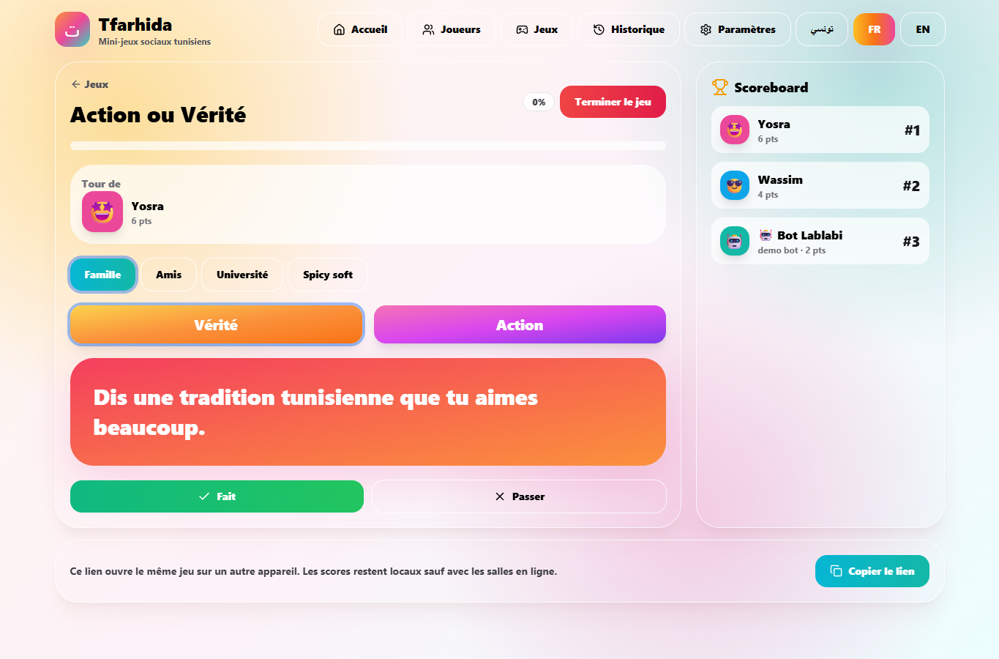
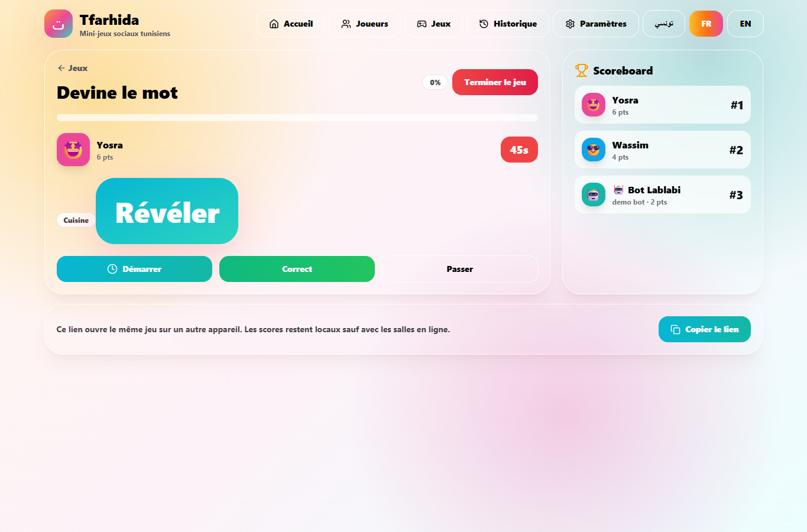
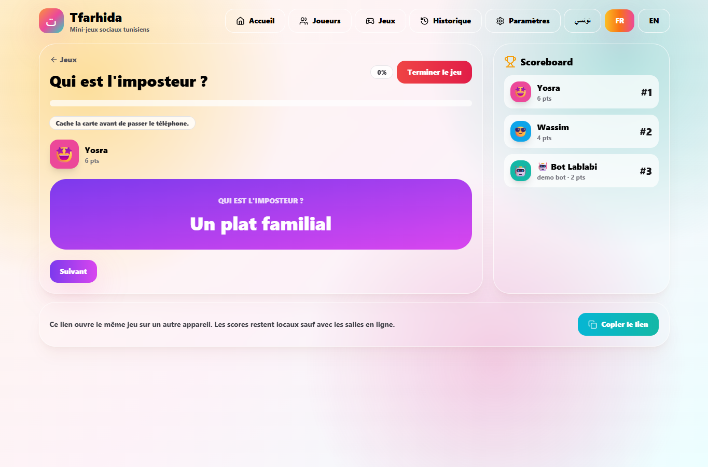
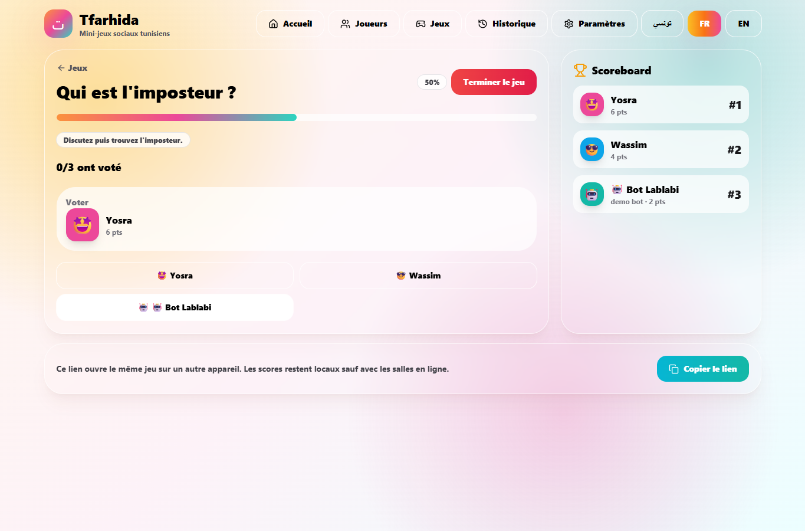
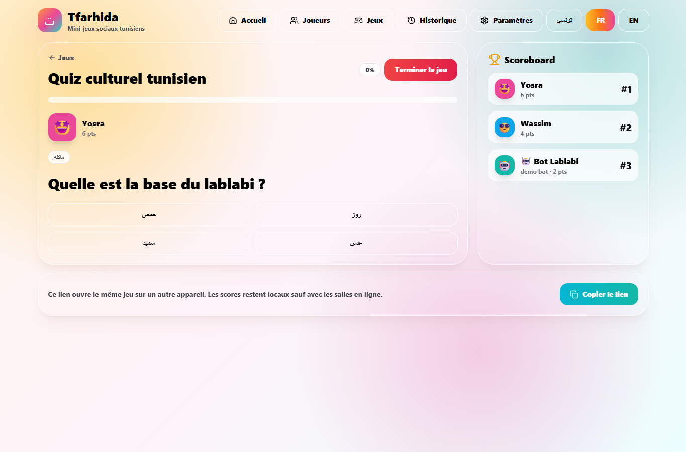
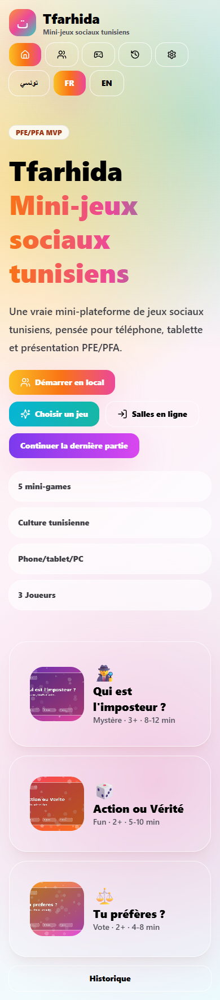
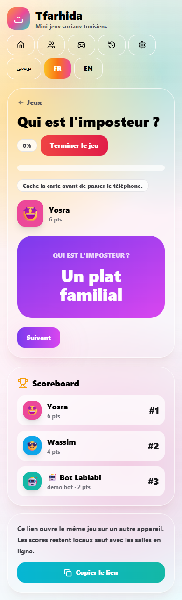

# Rapport de Projet de Fin d’Études

**Tfarhida — Application web de mini-jeux sociaux tunisiens**  
Réalisé par : **Yosra El Hadj Brayek** et **Wassim Chommakh**  
Encadrante pédagogique : **Madame Imen Herzi**  
Institution : **Leaders University — Nabeul**  
Année universitaire : **2025–2026**

## Remerciements

Avant d’entamer ce rapport, nous tenons à exprimer notre profonde gratitude envers toutes les personnes qui ont contribué, de près ou de loin, à la réalisation de ce projet.

Nous remercions tout particulièrement notre encadrante pédagogique, Madame Imen Herzi, pour ses orientations éclairées, sa rigueur et sa disponibilité constante. Ses retours constructifs ont été déterminants dans l’amélioration de la qualité du travail réalisé.

Nous adressons également nos remerciements au corps enseignant de Leaders University — Nabeul, pour la qualité de la formation dispensée et les valeurs transmises tout au long de notre parcours académique.

Enfin, nous remercions nos familles et nos proches pour leur soutien moral, leur patience et leurs encouragements constants.

## Résumé

Tfarhida est une application web statique de mini-jeux sociaux inspirés de la culture tunisienne. Le projet vise à proposer une expérience conviviale, multilingue et responsive permettant à des amis, familles ou étudiants de jouer localement sur un seul appareil. L’application intègre cinq jeux MVP, une gestion locale des joueurs, des scores, un historique de sessions, une interface en tunisien, français et anglais, ainsi qu’une architecture optionnelle pour des salles en ligne via Firebase. Le choix de GitHub Pages impose une architecture frontend statique, complétée par localStorage pour le mode local et par Firebase comme solution externe pour le temps réel.

**Mots-clés :** React, Vite, mini-jeux, culture tunisienne, GitHub Pages, Firebase, PFE.

## Abstract

Tfarhida is a static web application for Tunisian-inspired social mini-games. It provides a polished, multilingual and responsive local party experience where friends, families or students can play on one shared device. The MVP includes five mini-games, local player management, scores, session history, support for Tunisian Arabic, French and English, and an optional Firebase architecture for online rooms. GitHub Pages hosting leads to a static frontend design, with localStorage for offline/local persistence and Firebase as the external realtime service when configured.

**Keywords:** React, Vite, social games, Tunisian culture, GitHub Pages, Firebase, final-year project.

## Table des matières

1. Introduction générale  
2. Cadre général du projet  
3. Étude de l’existant et problématique  
4. Analyse et spécification des besoins  
5. Conception  
6. Réalisation technique  
7. Tests et validation  
8. Déploiement  
9. Conclusion générale  
10. Bibliographie et annexes

## Liste des figures

Les figures sont intégrées dans les chapitres correspondants : architecture, cas d’utilisation, interfaces principales, jeux, résultats, responsive et déploiement.

## Liste des tableaux

Les tableaux présentent les besoins fonctionnels, les besoins non fonctionnels, les acteurs, les technologies, les jeux MVP, les tests et les limites.

# Introduction générale

La transformation numérique touche également les usages de divertissement social. Les jeux de groupe, souvent joués lors de soirées familiales, entre amis ou dans un cadre universitaire, sont généralement dispersés entre des cartes physiques, des applications étrangères ou des contenus peu adaptés au contexte culturel local. En Tunisie, les références culturelles, la langue et les habitudes sociales donnent une couleur particulière aux moments de jeu.

Le projet Tfarhida propose une application web de mini-jeux sociaux tunisiens, accessible depuis un téléphone, une tablette ou un ordinateur. L’objectif est de créer un MVP professionnel, présentable dans le cadre d’un PFE Bachelor, qui fonctionne immédiatement en mode local tout en préparant une évolution vers des salles en ligne synchronisées via Firebase.

# Chapitre 1 — Cadre général du projet

## Contexte académique

Ce projet s’inscrit dans le cadre d’un Rapport de Projet de Fin d’Études à Leaders University — Nabeul, au titre de l’année universitaire 2025–2026. Il est réalisé principalement par Yosra El Hadj Brayek avec la contribution de Wassim Chommakh, sous l’encadrement pédagogique de Madame Imen Herzi.

## Évolution du concept BitBox vers Tfarhida

Le cahier de charge initial mentionnait le nom BitBox. Durant l’évolution du projet, l’identité a été réorientée vers Tfarhida afin de mieux exprimer l’ancrage culturel tunisien et le caractère social de l’application. Cette évolution ne change pas le cœur fonctionnel du projet, mais renforce son positionnement : une expérience locale, chaleureuse, multilingue et adaptée aux soirées tunisiennes.

## Objectifs

L’objectif principal consiste à concevoir et réaliser une application web statique, responsive et visuelle, capable de proposer plusieurs mini-jeux sociaux. Les objectifs spécifiques sont : gérer des joueurs locaux, choisir un mini-jeu, jouer des manches, calculer des scores, afficher des résultats, conserver un historique local, supporter plusieurs langues et préparer une extension vers des salles en ligne.

## Utilisateurs cibles

Les utilisateurs visés sont les étudiants, familles, groupes d’amis, clubs universitaires et équipes qui souhaitent animer un moment social sans installation complexe.

# Chapitre 2 — Étude de l’existant et problématique

Les jeux sociaux numériques existants sont souvent centrés sur un seul type de jeu ou sur une culture internationale générique. Ils peuvent manquer de contenu tunisien, de support multilingue ou d’un mode local simple. Les applications multijoueurs nécessitent fréquemment un backend ou une connexion permanente, ce qui complique le déploiement d’un MVP académique.

La problématique retenue est donc la suivante : comment concevoir une application de mini-jeux sociaux tunisiens, simple à déployer, accessible sur plusieurs formats d’écran, jouable localement sans compte et évolutive vers un mode en ligne sérieux sans simuler de faux multijoueur ?

# Chapitre 3 — Analyse et spécification des besoins

L’application doit répondre à des besoins fonctionnels liés au jeu, à la gestion des joueurs, aux langues, aux scores et au déploiement. Elle doit également respecter des contraintes non fonctionnelles : performance, sécurité, maintenabilité, accessibilité et compatibilité GitHub Pages.

## Tableau — Besoins fonctionnels

|Réf.|Besoin|Description|
|---|---|---|
|BF1|Gestion des joueurs|Ajouter, modifier, supprimer joueurs et bots démo explicites.|
|BF2|Bibliothèque de jeux|Afficher les cinq mini-jeux MVP avec règles et conditions de joueurs.|
|BF3|Déroulement de partie|Lancer une partie locale, jouer les manches, voter ou répondre.|
|BF4|Scores et résultats|Calculer les scores, afficher le classement et sauvegarder l’historique.|
|BF5|Internationalisation|Supporter tn, fr et en avec RTL pour la langue tunisienne.|
|BF6|Salles en ligne optionnelles|Préparer l’architecture Firebase sans simuler le temps réel.|

## Tableau — Besoins non fonctionnels

|Réf.|Besoin|Description|
|---|---|---|
|BNF1|Responsive|Fonctionnement téléphone, tablette et ordinateur.|
|BNF2|Performance|Application statique légère hébergée sur GitHub Pages.|
|BNF3|Sécurité|Aucun mot de passe dans localStorage, pas de secrets commités.|
|BNF4|Maintenabilité|Architecture modulaire React/TypeScript.|
|BNF5|Accessibilité|Boutons larges, contrastes, focus visible, parcours simple.|

## Tableau — Acteurs

|Acteur|Rôle|
|---|---|
|Joueur local|Participe à une partie sur un seul appareil.|
|Hôte de partie|Configure les joueurs, choisit un jeu et termine la session.|
|Participant en ligne|Rejoint une salle si Firebase est configuré.|
|Développeur/Admin|Maintient le code, configure Firebase et déploie l’application.|

# Chapitre 4 — Conception

## Architecture générale

L’architecture retenue est volontairement statique pour respecter la contrainte GitHub Pages. Le navigateur charge l’application React/Vite, qui gère l’interface, les routes et les interactions. Le mode local sauvegarde les joueurs, scores et préférences dans localStorage sous le namespace `tfarhida.v1.*`. Les salles en ligne ne sont pas simulées : elles nécessitent Firebase Auth et Firestore lorsqu’elles seront configurées.

## Architecture logique

La couche présentation regroupe les composants React, les pages, les cartes de jeux, les boutons et les écrans de gameplay. La couche état repose sur Zustand et localStorage. La couche données contient les questions, prompts et traductions. La couche services regroupe storageService, authService, roomService et la détection de configuration Firebase. La couche déploiement repose sur Vite, GitHub Actions et GitHub Pages.

## Conception de la navigation

Les routes principales sont : `/`, `/players`, `/games`, `/play/:gameId`, `/results`, `/settings`, `/about`, `/online` et `/room/:roomCode`. HashRouter est utilisé pour éviter les erreurs 404 lors d’un rafraîchissement sur GitHub Pages.

## Conception des jeux

Chaque jeu est modélisé avec un objectif, un minimum de joueurs, des phases et une logique de score. Le jeu Qui est l’imposteur dispose d’une phase de révélation privée, d’une discussion, d’un vote et d’un résultat. Le quiz utilise des cartes de réponses qui soumettent immédiatement le choix. Tu préfères utilise un vote direct et des barres de résultats. Action ou Vérité ajoute des niveaux de contenu. Devine le mot intègre un timer et des mots interdits.

## Conception UX/UI

La conception suit une approche mobile-first. Les boutons sont larges, colorés et facilement activables au doigt. La palette utilise l’orange et le jaune pour l’énergie, le magenta pour le social, le violet pour le mystère, le teal pour l’information, le vert pour le succès et le rouge pour les actions dangereuses. La langue tunisienne est affichée avec un sens RTL, tandis que le français et l’anglais restent en LTR.

## Tableau — Technologies utilisées

|Technologie|Rôle|
|---|---|
|React|Construction de l’interface utilisateur.|
|Vite|Bundling et configuration GitHub Pages.|
|TypeScript|Typage et robustesse du code.|
|Tailwind CSS|Design responsive et système visuel.|
|Zustand|État global léger.|
|localStorage|Persistance locale.|
|Firebase|Authentification et Firestore optionnels.|
|GitHub Pages/Actions|Hébergement et déploiement statique.|

## Tableau — Jeux MVP

|Jeu|Joueurs|Principe|Score|
|---|---|---|---|
|Tu préfères ?|2+|Deux choix et vote par joueur.|Majorité gagnante par manche.|
|Action ou Vérité|2+|Prompt vérité ou défi selon niveau.|Points si réalisé.|
|Devine le mot|2+|Faire deviner un mot avec timer.|Point si correct.|
|Qui est l’imposteur|3+|Mot secret sauf imposteur, discussion, vote.|Équipe ou imposteur gagne.|
|Quiz tunisien|1+|Questions QCM culturelles.|Points par bonne réponse.|

## Tableau — Structure des données

|Entité|Champs principaux|Usage|
|---|---|---|
|Player|id, name, avatar, color, score, isBot|Joueurs locaux et bots démo.|
|Game|id, name, minPlayers, duration, image|Catalogue des jeux.|
|Score|playerId, score|Classement.|
|SessionHistory|id, gameId, date, winner, scores|Historique local.|
|Room|code, hostId, players, scores, phase|Salle Firestore optionnelle.|
|GameContent|id, category, text tn/fr/en|Questions et prompts multilingues.|

*Figure 4.1 — Architecture générale de Tfarhida.*

*Figure 4.2 — Flux du mode local.*

*Figure 4.3 — Flux des salles en ligne avec Firebase.*

*Figure 4.4 — Diagramme des cas d'utilisation.*

# Chapitre 5 — Réalisation technique

La réalisation utilise React, Vite, TypeScript, Tailwind CSS, Framer Motion et Zustand. Le projet est organisé en composants UI, composants de jeux, services et données multilingues. La configuration Vite utilise la base `/Tfarhida/` en production et un fallback racine pour garantir la stabilité de GitHub Pages lorsque la source Pages pointe vers la branche principale.

## Gestion des assets

Les images applicatives finales sont placées dans `public/assets/app/`. Les images de référence, notamment le plan manuscrit, sont isolées dans `public/assets/references/` et ne sont pas utilisées par l’interface utilisateur. Cette séparation évite l’apparition d’images non professionnelles dans le MVP final.

## Internationalisation

Le système i18n supporte `tn`, `fr` et `en`. Les textes visibles principaux sont traduits, et l’application passe automatiquement en RTL pour la langue tunisienne.

## Persistance locale

Le mode local utilise localStorage avec le préfixe `tfarhida.v1.*`. Les données sauvegardées comprennent la langue, les joueurs, les scores, l’historique, les paramètres et le dernier jeu joué.

*Figure 5.1 — Page d'accueil de l'application Tfarhida.*

*Figure 5.2 — Interface de gestion des joueurs.*

*Figure 5.3 — Bibliothèque des mini-jeux.*

*Figure 5.4 — Déroulement du jeu Tu préfères.*

*Figure 5.5 — Déroulement du jeu Action ou Vérité.*

*Figure 5.6 — Déroulement du jeu Devine le mot.*

*Figure 5.7 — Révélation privée dans Qui est l'imposteur.*

*Figure 5.8 — Phase de vote dans Qui est l'imposteur.*

*Figure 5.9 — Interface du quiz culturel tunisien.*

# Chapitre 6 — Tests et validation

Les tests réalisés couvrent le build, le typage, le lint, la navigation, les langues, la persistance locale, les jeux, les scores, le responsive et les pages GitHub Pages. Un test spécifique vérifie que le fichier construit ne référence pas `/src/main.tsx` et que les assets de production sont disponibles.

|Test|Résultat attendu|Statut|
|---|---|---|
|Build TypeScript|Aucune erreur|Validé|
|Lint|Aucune erreur|Validé|
|Build production|Dist généré sans référence /src/main.tsx|Validé|
|Fresh browser|Aucun faux joueur par défaut|Validé|
|Gating joueurs|Cartes d’erreur localisées|Validé|
|Online sans Firebase|Message honnête de configuration|Validé|
|Screenshots|14 captures générées|Validé|

*Figure 6.1 — Écran des résultats et historique.*

*Figure 6.2 — Affichage mobile de la page d’accueil.*

*Figure 6.3 — Affichage mobile d’un gameplay.*

# Chapitre 7 — Déploiement

Le dépôt GitHub est `git@github.com:jodouma/Tfarhida.git`. L’application publique est disponible à l’adresse : https://jodouma.github.io/Tfarhida/. Le déploiement s’appuie sur GitHub Pages et GitHub Actions. La configuration Vite utilise la base `/Tfarhida/`, et HashRouter évite les erreurs 404 lors des rafraîchissements.

Le mode en ligne reste optionnel et dépend de Firebase. Sans configuration Firebase, l’application affiche une page claire indiquant que les salles en ligne nécessitent une configuration externe. Cette décision respecte la contrainte de ne pas simuler un faux multijoueur.

*Figure 7.1 — Page de configuration requise pour les salles en ligne.*

# Conclusion générale

Le projet Tfarhida a permis de concevoir et réaliser un MVP fonctionnel de mini-jeux sociaux tunisiens. Le mode local est opérationnel, les cinq jeux sont disponibles, l’interface est responsive et multilingue, et le déploiement GitHub Pages est stabilisé. La principale limite concerne le mode en ligne temps réel, qui nécessite une configuration Firebase complète avant production.

Les perspectives incluent l’activation réelle de Firebase, l’enrichissement du contenu culturel tunisien, l’ajout d’un tableau de bord d’administration, une version mobile packagée, des effets sonores, davantage d’avatars et des statistiques d’usage.

# Bibliographie / Webographie

- Documentation React : https://react.dev/
- Documentation Vite : https://vite.dev/
- Documentation TypeScript : https://www.typescriptlang.org/docs/
- Documentation Tailwind CSS : https://tailwindcss.com/docs
- Documentation Firebase : https://firebase.google.com/docs
- Documentation GitHub Pages : https://docs.github.com/pages
- Documentation GitHub Actions : https://docs.github.com/actions

# Annexes

Les annexes comprennent le résumé du cahier de charge initial, la checklist de tests, l’exemple d’environnement Firebase, les routes de l’application, les règles de jeux et l’inventaire des assets.

## Tableau — Limites et perspectives

|Limite|Perspective|
|---|---|
|Firebase non configuré en production|Activer Auth/Firestore et règles de sécurité.|
|Contenu de démonstration|Enrichir les banques de questions.|
|Pas d’application native|Créer un wrapper mobile Capacitor.|
|Pas de dashboard admin|Ajouter une interface de gestion de contenu.|
